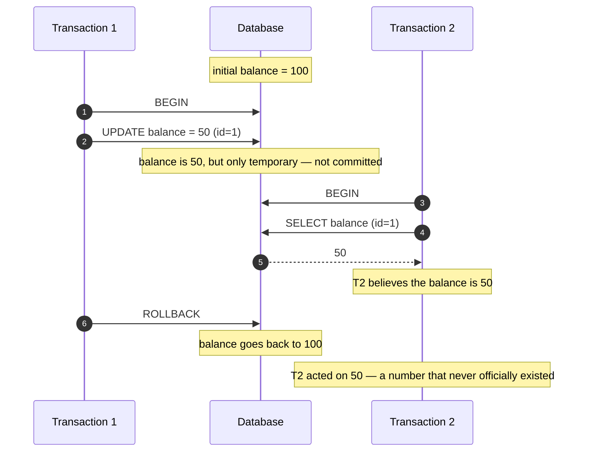
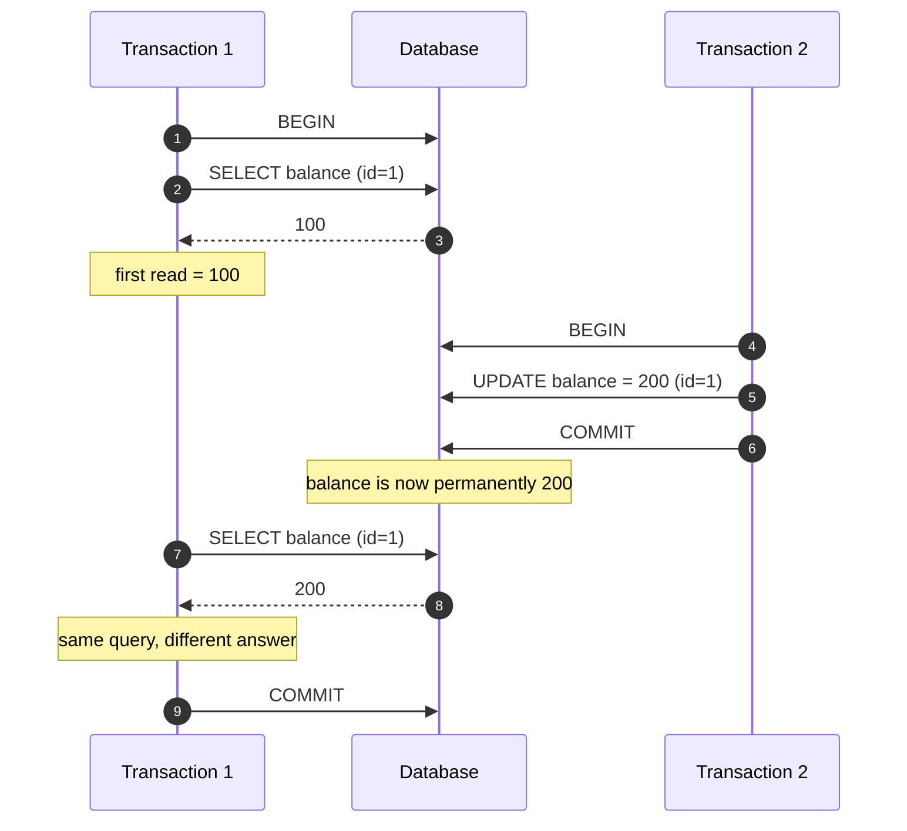
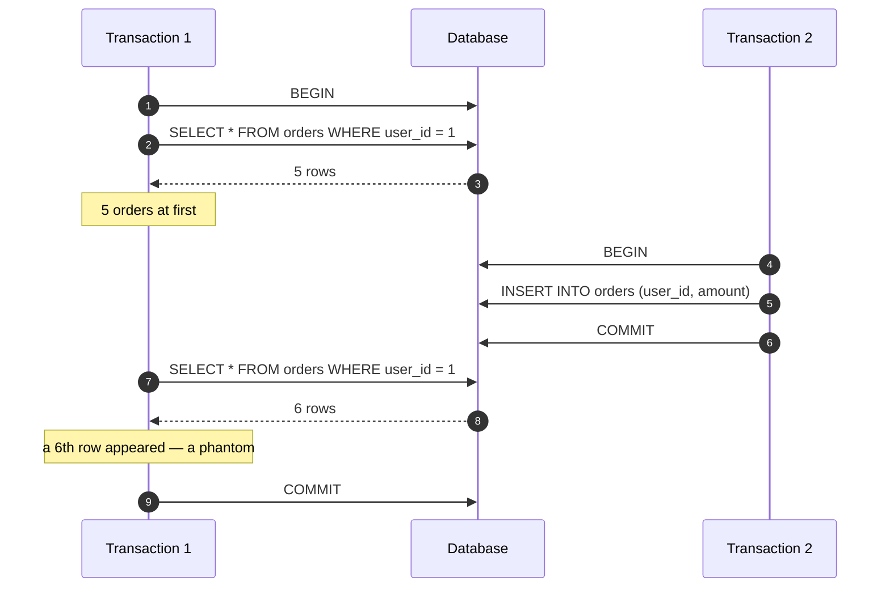
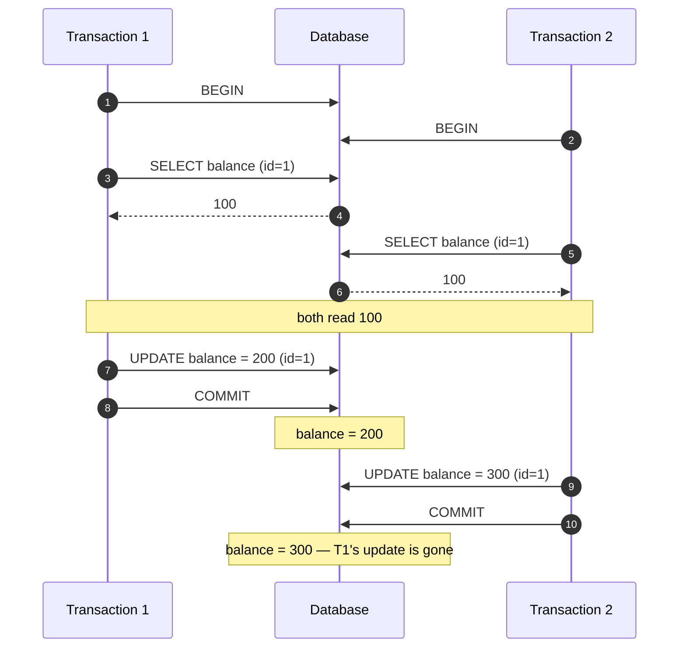
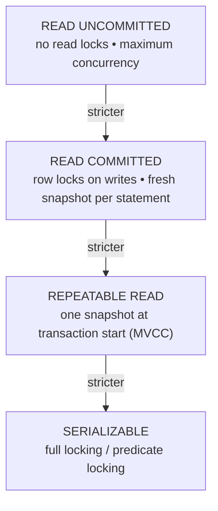

When many people use an app at the same time, the database is running many operations side by side. Most of the time this is fine — but sometimes those operations step on each other and produce wrong answers. This post explains, from scratch, the four classic ways this goes wrong and the "isolation levels" databases use to prevent them.

## 0. The Basics First

A few words you need before anything else:

- **Transaction** — a group of database operations treated as one unit of work. Example: "move $100 from account A to account B" is two updates that must both succeed or both fail.
- **Concurrent transactions** — two or more transactions running at the same time.
- **COMMIT** — "I'm done, save my changes permanently."
- **ROLLBACK** — "Something went wrong, undo everything I did."
- **Uncommitted data** — changes a transaction has made but not yet committed. They are still temporary and could be rolled back.

The whole problem: if transaction 1 can *see* transaction 2's unfinished work, or if both edit the same row at once, the result can be data that never should have existed.

> **Analogy:** two people editing the same bank account at an ATM at the same time. If neither knows what the other is doing, someone's deposit can vanish.

## 1. The Four Anomalies

We'll go from the mildest to the most dangerous. In every diagram, **T1** and **T2** are two transactions running at the same time, and **DB** is the database.

### 1.1 Dirty Read — reading someone's unfinished work

T1 changes a value but has not committed. T2 reads that change. Then T1 rolls back — meaning the change never actually happened — but T2 already acted on it.



**Why it's bad:** T2 makes a decision based on data that was undone. Real-world example: a bank shows you a balance that later disappears.

### 1.2 Non-Repeatable Read — the same question gives two answers

T1 reads a value. T2 changes and commits it. T1 reads the *same* value again and gets a different number — inside the same transaction.



**Why it's bad:** code that does "read, check, then act" can break, because the value changed between the read and the act.

### 1.3 Phantom Read — new rows appear out of nowhere

T1 runs a query that matches several rows. T2 inserts a new row that also matches. When T1 runs the *same* query again, there is an extra row — a "phantom".



**Why it's bad:** counts, totals, and reports become unreliable (e.g. "5 items in stock" then suddenly 6).

### 1.4 Lost Update — two writes, one vanishes

Both transactions read the same value, both write a new value, and the second write overwrites the first. One update is silently lost.



**Why it's bad:** no error is raised. The data is simply wrong, which is the hardest kind of bug to find. It is prevented by `REPEATABLE READ` and above (see the table in the next section), and can also be solved from the application with OCC or a `FOR UPDATE` lock (Section 4).

## 2. Isolation Levels — One Dial from Loose to Strict

Databases offer a setting called **isolation level**. Think of it as a dial:

- Turn it **down** → faster and more concurrent, but anomalies are allowed.
- Turn it **up** → safer and more correct, but slower and more transactions block each other.

The four levels form a ladder, and each step up adds a stronger mechanism:



There are four levels. The table shows which anomaly each one prevents:

| Isolation level | Dirty read | Non-repeatable read | Phantom read | Lost update |
|-----------------|-----------|---------------------|--------------|-------------|
| **READ UNCOMMITTED** | Allowed | Allowed | Allowed | Allowed |
| **READ COMMITTED** | Prevented | Allowed | Allowed | Allowed |
| **REPEATABLE READ** | Prevented | Prevented | Allowed* | Prevented† |
| **SERIALIZABLE** | Prevented | Prevented | Prevented | Prevented |

> \* In the SQL standard, REPEATABLE READ still allows phantoms. In practice, PostgreSQL prevents them too (its snapshot is stronger than the standard requires), while MySQL (InnoDB) allows them unless gap locks are used.

> † At REPEATABLE READ, most databases (PostgreSQL, MySQL InnoDB, Oracle) prevent lost updates using **first-updater-wins**: if two transactions try to write the same row, the second one is rejected with a serialization error and must retry. It is not prevented by `READ COMMITTED`, where the later write simply overwrites the earlier one.

**What each level means in plain words:**

- **READ UNCOMMITTED** — "I'll read anything, even unfinished work." Fastest, least safe. **Mechanism:** no read locks, so nothing ever blocks.
- **READ COMMITTED** — "I'll only read committed data." Each statement sees the latest committed state, but another transaction can still overwrite your row (lost update). **Mechanism:** row locks on writes; a fresh snapshot per statement.
- **REPEATABLE READ** — "Once I read a row, it looks the same for my whole transaction." A competing write to the same row is rejected (lost update prevented). **Mechanism:** MVCC keeps one snapshot taken at transaction start.
- **SERIALIZABLE** — "Behave as if transactions ran one after another." Safest, slowest. **Mechanism:** full locking or predicate (range) locking, so conflicts are *prevented*, not just detected.

**Default levels** (what you get if you change nothing):

| Database | Default |
|----------|---------|
| PostgreSQL | `READ COMMITTED` |
| MySQL (InnoDB) | `REPEATABLE READ` |
| SQL Server | `READ COMMITTED` |
| Oracle | `READ COMMITTED` |

> **Important note:** isolation is set **per transaction**, not once for the whole database. Two transactions running at the same time can use two different levels. For example, a slow reporting query can run at `READ UNCOMMITTED` while a payment update runs at `SERIALIZABLE`. The session or server setting is only a default — each transaction can override it.

## 3. Setting Isolation Levels

```sql
-- PostgreSQL: for a single transaction
BEGIN ISOLATION LEVEL REPEATABLE READ;
SET TRANSACTION ISOLATION LEVEL SERIALIZABLE;

-- PostgreSQL: change the default for the session
SET default_transaction_isolation = 'REPEATABLE READ';
```

```sql
-- MySQL: for the next transaction
SET TRANSACTION ISOLATION LEVEL REPEATABLE READ;
START TRANSACTION;

-- MySQL: change the default for the session
SET SESSION TRANSACTION ISOLATION LEVEL READ COMMITTED;
```

Because each transaction declares its own level, you can mix them based on what that specific operation needs.

## 4. Other Ways to Prevent the Problems

Isolation levels are not the only tool. These are usually used from application code.

### 4.1 OCC — Optimistic Concurrency Control

Add a `version` column to the row. When you update, you only succeed if the version is still the one you read. If someone changed the row in between, the update affects 0 rows and you retry.

```sql
UPDATE accounts
SET balance = 200, version = version + 1
WHERE id = 1 AND version = 5;  -- 0 rows means someone else changed it
```

This is "optimistic" because it assumes conflicts are rare.

### 4.2 Pessimistic Locking

Lock the row before you touch it, so nobody else can. This is "pessimistic" because it assumes a conflict is likely.

```sql
SELECT * FROM accounts WHERE id = 1 FOR UPDATE;              -- other writers wait
SELECT * FROM accounts WHERE id = 1 FOR UPDATE SKIP LOCKED;  -- skip busy rows
```

### 4.3 MVCC — Multi-Version Concurrency Control

This is the trick behind the scenes in PostgreSQL, MySQL InnoDB, and Oracle. Instead of overwriting a row, the database keeps **multiple versions** of it. Readers see the version that existed when their transaction started; writers create a new version. So readers never block writers and writers never block readers.

```text
Versions of row id=1 (newest on top):

  [ v5: balance = 300 ]   <- current value
  [ v4: balance = 200 ]   <- what an older REPEATABLE READ txn still sees
  [ v3: balance = 100 ]

Older transactions keep reading their snapshot; new ones read the newest version.
```

## 5. Which Level Should You Use?

| Scenario | Recommended level | Reason |
|----------|-------------------|--------|
| Analytics / reporting | `READ UNCOMMITTED` | Speed matters more than exact accuracy |
| High-throughput OLTP | `READ COMMITTED` | Good balance of correctness and speed |
| Financial transactions | `REPEATABLE READ` | A stable view across multiple steps |
| Inventory / booking | `SERIALIZABLE` | Prevents overselling |
| High contention on a few rows | OCC (version column) | Avoids long lock waits; retry on conflict |

> **Caveat:** PostgreSQL does not implement true `READ UNCOMMITTED` — it silently maps it to `READ COMMITTED`, so you never actually get dirty reads there. MySQL supports it for real. For most analytics work, `READ COMMITTED` is a safer default.

## Key Takeaways

1. Know your database's default — PostgreSQL is `READ COMMITTED`, MySQL is `REPEATABLE READ`.
2. Isolation is **per transaction**, so you can mix levels across concurrent transactions.
3. MVCC is not the same as `SERIALIZABLE`: it removes dirty reads and non-repeatable reads, but not phantoms. `REPEATABLE READ` does stop lost updates.
4. `SERIALIZABLE` is safe but costly — expect lock waits and retries.
5. Often the simplest fix is at the application level: a `version` column (OCC) or `SELECT ... FOR UPDATE`.
6. Always test under concurrency, not just with one user — try `pgbench`, `sysbench`, or your own load test.

## Mini Glossary

| Term | Meaning |
|------|---------|
| Transaction | A group of operations that succeed or fail together |
| Commit | Permanently save a transaction's changes |
| Rollback | Undo a transaction's changes |
| Anomaly | A wrong result caused by concurrent transactions |
| Isolation level | How much a transaction is allowed to see of others' work |
| Snapshot | A frozen view of the data at a specific point in time |
| Lock | A claim on a row that stops others from changing it until released |
| MVCC | Keeping multiple row versions so readers and writers don't block |
| OCC | Detecting conflicts by version number and retrying |
| Serialization error | An error thrown when the database rejects a transaction to keep data safe; the app should retry |