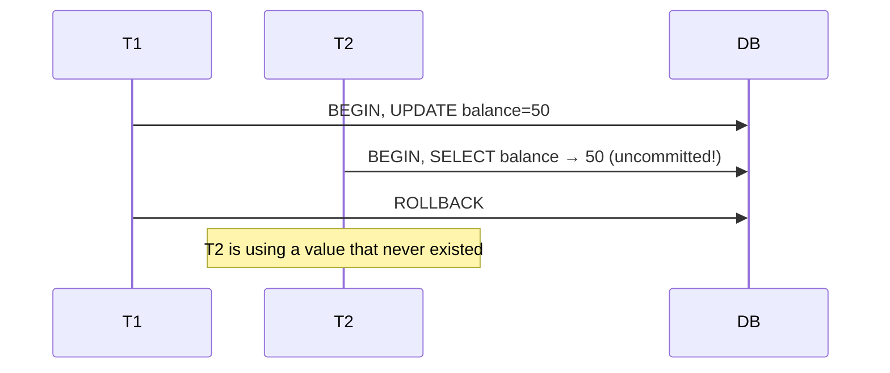
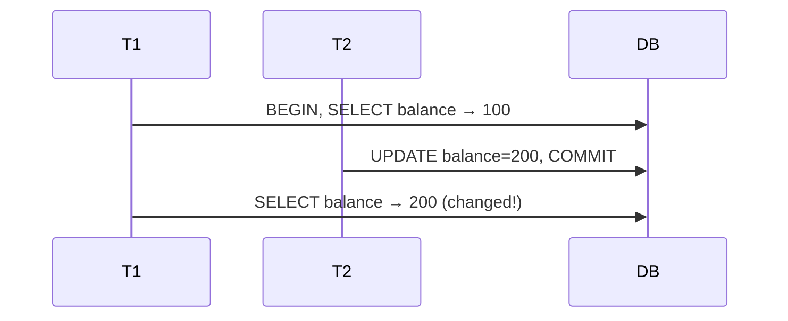
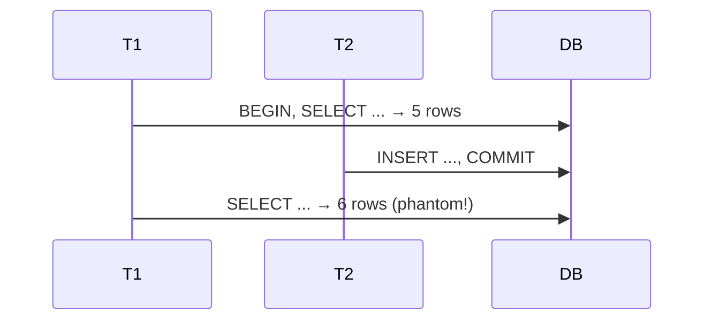
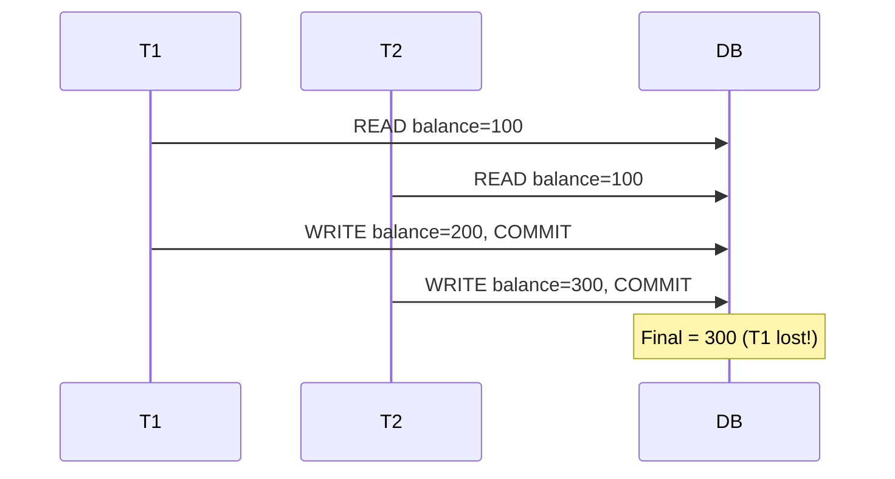

Notes on the four classic concurrency anomalies, the SQL isolation levels that fix them, and when to use which.

## 1. The Four Anomalies

Ordered from least to most severe.

### 1.1 Dirty Read
Reading uncommitted data that later rolls back.



### 1.2 Non-Repeatable Read
Same query, different result within one transaction.



### 1.3 Phantom Read
A repeated range query returns a different row set.



### 1.4 Lost Update
Two writes, one silently lost — no error, just wrong data.



## 2. Isolation Levels

| Level | Dirty | Non-Repeatable | Phantom | Mechanism |
|-------|:-----:|:--------------:|:-------:|-----------|
| READ UNCOMMITTED | ❌ | ❌ | ❌ | No locks |
| READ COMMITTED | ✅ | ❌ | ❌ | Row locks on write; snapshot reads |
| REPEATABLE READ | ✅ | ✅ | ❌* | MVCC snapshot at txn start |
| SERIALIZABLE | ✅ | ✅ | ✅ | Predicate locking / full serialization |

> \* PostgreSQL's REPEATABLE READ uses snapshot isolation and blocks phantoms; MySQL allows them without gap locks.

**Defaults:** PostgreSQL = `READ COMMITTED`, MySQL = `REPEATABLE READ`, SQL Server = `READ COMMITTED`, Oracle = `READ COMMITTED`.

> **Note:** Isolation is set **per transaction**, not per database. Different transactions running at the same time can use different levels — e.g. a reporting txn on `READ UNCOMMITTED` while a payment txn uses `SERIALIZABLE`. The session/global setting only provides a default; each txn can override it.

## 3. Setting Isolation Levels

```sql
-- PostgreSQL: per transaction
BEGIN ISOLATION LEVEL REPEATABLE READ;
SET TRANSACTION ISOLATION LEVEL SERIALIZABLE;

-- PostgreSQL: session default
SET default_transaction_isolation = 'REPEATABLE READ';
```

```sql
-- MySQL: per transaction
SET TRANSACTION ISOLATION LEVEL REPEATABLE READ;
START TRANSACTION;

-- MySQL: session default
SET SESSION TRANSACTION ISOLATION LEVEL READ COMMITTED;
```

Each transaction declares its own level, so mix them freely based on what that operation needs.

## 4. Prevention Mechanisms

### 4.1 OCC (Optimistic Concurrency Control)
Version column; fail if the row changed since you read it.

```sql
UPDATE accounts
SET balance = 200, version = version + 1
WHERE id = 1 AND version = 5;  -- 0 rows = conflict, retry
```

### 4.2 Pessimistic Locking
Grab the row up front.

```sql
SELECT * FROM accounts WHERE id = 1 FOR UPDATE;              -- blocks writers
SELECT * FROM accounts WHERE id = 1 FOR UPDATE SKIP LOCKED;  -- skip busy rows
```

### 4.3 MVCC
Readers don't block writers; each txn sees a start-time snapshot.

```text
row id=1 version chain:
[v5 balance=300] current
[v4 balance=200] visible to older REPEATABLE READ txn
[v3 balance=100]
```

## 5. When to Use What

| Scenario | Level | Why |
|----------|-------|-----|
| Analytics / Reporting | READ UNCOMMITTED | Speed > accuracy |
| High-throughput OLTP | READ COMMITTED | Consistency + perf balance |
| Financial txns | REPEATABLE READ | Stable multi-step view |
| Inventory / Booking | SERIALIZABLE | Prevent overselling |
| High contention | OCC (version) | Avoid lock contention, retry |

## Key Takeaways

1. Know your default — PG=READ COMMITTED, MySQL=REPEATABLE READ.
2. Isolation is per-transaction; mix levels across concurrent txns.
3. MVCC ≠ Serializable: it fixes dirty/non-repeatable reads, not phantoms.
4. SERIALIZABLE is costly — expect retries on serialization failures.
5. App-level OCC or `FOR UPDATE` is often the pragmatic choice.
6. Test concurrency with `pgbench`, `sysbench`, or load tests.