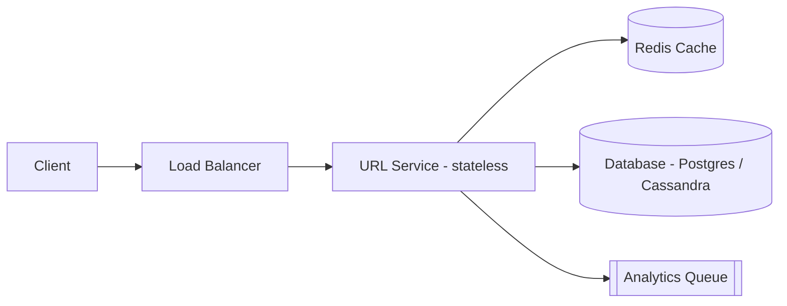
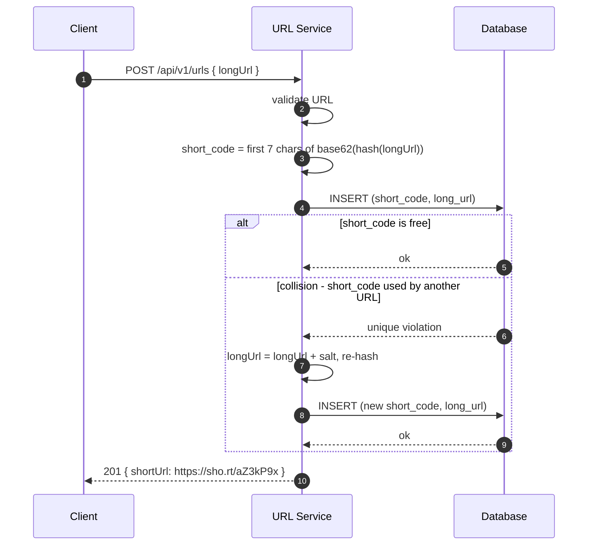
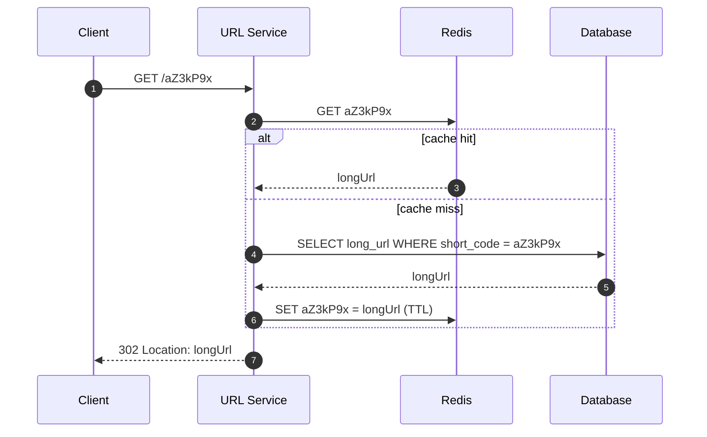

A URL shortener takes a long URL and gives back a short one (like `https://sho.rt/aZ3kP9x`). Hitting the short URL redirects the user to the original. It looks trivial, but it is a great system design interview question because it forces you to think about key generation, caching, storage at scale, and read/write tradeoffs.

This walkthrough goes from requirements to a working architecture, at a level you'd discuss for an SDE-2 interview.

## 1. Requirements

**Functional**

- **Shorten**: given a long URL, return a short URL.
- **Redirect**: given a short code, redirect to the original URL.

**Non-functional**

- **Highly available** — a dead redirect link breaks every page that uses it.
- **Fault tolerant** — machines and disks will fail; the system must survive.
- **Correct/consistent** — a code must *always* point to the right URL.
- **Low latency** — redirects should be a few milliseconds.
- **Highly scalable** — reads dominate writes by ~10x.

## 2. Back-of-the-Envelope Estimation

Before designing, we make a rough guess of how big the system is. This tells us whether one server is enough or whether we need thousands.

First, two units we'll use:

- **QPS (queries per second)** — how many requests the system handles each second.
- **86,400** — the number of **seconds in a day** (`24 hours × 60 minutes × 60 seconds`). Dividing a "per day" number by 86,400 turns it into a "per second" number.

We are given two traffic numbers to design for: **100 million new URLs per day** and **1 billion redirects per day**:

| What we're estimating | Calculation | Result |
|-----------------------|-------------|--------|
| New short URLs per second (writes) | 100,000,000 ÷ 86,400 | ~1,200 per second |
| Redirects per second (reads) | 1,000,000,000 ÷ 86,400 | ~11,600 per second |
| Reads for every write | 1,000,000,000 ÷ 100,000,000 | 10 reads per write |
| URLs stored in 10 years | 100,000,000 × 365 × 10 | ~365 billion |
| Storage | 365 billion × ~100 bytes each | ~36.5 TB |

> Traffic is not flat: at peak times it can be about **2x the average**, so plan for roughly **2,400 writes/sec** and **23,000 reads/sec**.

Two conclusions fall out of this:

1. **Reads are 10x writes** → optimize reads first (caching, and **read replicas** — copies of the database that serve reads), not writes.
2. **365 billion URLs** over 10 years → the short code must support that many unique values.

## 3. How Long Should the Short Code Be?

A short code is built from letters and digits only, so each character has 62 possible values: `26` uppercase + `26` lowercase + `10` digits = **62**.

With `n` characters we can represent `62^n` different codes:

```text
62^6 = 56.8 billion      -> not enough (need 365 billion)
62^7 = 3.52 trillion     -> enough
```

So **7 characters** is the sweet spot. That also keeps the short URL tiny.

## 4. API Design

```text
POST /api/v1/urls
Body:     { "longUrl": "https://example.com/very/long/path" }
Response: 201 { "shortUrl": "https://sho.rt/aZ3kP9x", "shortCode": "aZ3kP9x" }

GET /{short_code}
Response: 302 Location: https://example.com/very/long/path
```

Optional extra (mention only): a **custom alias**, where the user picks their own code instead of a generated one (`POST` with `"alias": "my-link"`).

### 301 vs 302 redirect

- **301 (permanent)** — the browser caches the redirect, so repeat visits skip your server. Less load, but you lose analytics.
- **302 (temporary)** — every hit reaches your server, so you can count clicks. Most shorteners use **302**.

## 5. Data Model

The whole system is built on one small mapping: a short code → the original long URL.

```sql
CREATE TABLE urls (
    short_code  VARCHAR(7) PRIMARY KEY,
    long_url    TEXT NOT NULL,
    created_at  TIMESTAMP DEFAULT now()
);
```

- `short_code` is the **primary key** — a unique 7-character value. Because it's the key, looking up a code is indexed and fast.
- `long_url` is the destination we redirect to.
- `created_at` records when the link was created (useful for debugging and stats).

## 6. Key Generation (the hard part)

We need to turn a long URL into a 7-character **short code**. Almost every approach boils down to "produce a number, then encode it in base62". So let's first understand base62, then look at where the number comes from.

### 6.1 Base62 encoding, explained

Base62 just means writing numbers with **62 symbols** instead of the usual 10 digits:

```text
0-9  ->  10 symbols
A-Z  ->  26 symbols
a-z  ->  26 symbols
        -----------
        62 symbols total
```

The symbol set is `0123456789ABCDEFGHIJKLMNOPQRSTUVWXYZabcdefghijklmnopqrstuvwxyz`, where `0` is index 0, `A` is index 10, and `z` is index 61. Converting a number to base62 is the same idea as binary (base 2) or hex (base 16), just with base 62: repeatedly divide by 62 and collect the remainders.

```python
BASE62 = "0123456789ABCDEFGHIJKLMNOPQRSTUVWXYZabcdefghijklmnopqrstuvwxyz"

def encode(num: int, length: int = 7) -> str:
    chars = []
    while num > 0:
        num, rem = divmod(num, 62)
        chars.append(BASE62[rem])
    short_code = "".join(reversed(chars)) or "0"
    return short_code.rjust(length, "0")

encode(1)          # "0000001"
encode(12345678)   # "000pnfq"
encode(62**7 - 1)  # "zzzzzzz"
```

A few values make the pattern obvious:

| Number | Base62 (7 chars) |
|-------:|------------------|
| 0 | `0000000` |
| 1 | `0000001` |
| 61 | `000000z` |
| 62 | `0000010` |
| 12,345,678 | `000pnfq` |
| 3,521,614,606,207 | `zzzzzzz` |

Each extra character multiplies capacity by 62, which is exactly why 7 characters are enough (Section 3).

> **Why base62 and not base64?** Base64 uses `+`, `/`, and `=` — characters that need escaping in URLs. Base62 is URL-safe by design.

The approaches below differ only in **where the number comes from**.

### 6.2 Counter → base62 (sequential IDs)

Keep a global auto-increment counter (1, 2, 3, …) and base62-encode each value.

- **Pros**: no collisions, tiny codes, trivial to implement.
- **Cons**: **guessable** — anyone can increment the code and walk through other people's links. It also **leaks your volume**: the counter tells a competitor how many URLs you have shortened. And a single global counter is both a bottleneck and a **single point of failure** (if it goes down, no new links can be created).

### 6.3 Hash → base62 (MD5 / SHA-1) — recommended

Take a hash of the long URL, base62-encode the (large) hash number, then keep the first 7 characters.

A **hash function** turns any input into a fixed-size number, and the same input always gives the same number. A **salt** is a small piece of random text we add to the URL to get a different hash.

- **Pros**: unpredictable, and the same URL always produces the same code (useful for de-duplication).
- **Cons**: **collisions**. A hash is much longer than 7 characters, so keeping only the first 7 means two different URLs can land on the same 7 characters. You must detect that with a unique constraint and retry with a salt.

```sql
-- unique constraint on short_code makes collisions detectable
INSERT INTO urls (short_code, long_url) VALUES ('aZ3kP9x', 'https://example.com');
-- on unique violation: append a random salt to the URL and re-hash
```

Because **365 billion codes live in a 3.5 trillion space, collisions are inevitable** (birthday paradox), not a rare edge case. The unique constraint on `short_code` is what detects them, and the write path retries with a salt — the full flow is in [Section 8](#8-write-flow-shorten).

### 6.4 Distributed IDs (Snowflake)

Instead of one global counter, combine a timestamp, a machine id, and a per-machine sequence into a 64-bit number, then base62-encode it. No central coordination, no collisions across machines, and codes stay roughly time-ordered.

- **Pros**: scales horizontally without a central counter.
- **Cons**: needs clock synchronization; the structure can be reverse-engineered if it is known.

### Comparison

| Approach | Collisions | Guessable | Complexity |
|----------|-----------|-----------|------------|
| Counter → base62 | None | Yes | Low |
| Hash → base62 | Possible (handle + retry) | No | Medium |
| Snowflake → base62 | None | Somewhat | Medium |

For this design we use **hashing**: it is unpredictable and needs no extra service, and its one downside (collisions) is handled with a unique constraint and a salt-and-retry loop (Section 8). A bare counter is rarely acceptable because it is guessable; Snowflake is a good option when you want no central coordinator.

## 7. High-Level Architecture



Key ideas:

- **Stateless service** — it keeps no data between requests, so any instance can serve any request. That makes scaling easy: just add more instances behind the **load balancer**, which spreads incoming requests across them.
- **Redis** in front of the database → absorbs the 10x read traffic. Redis is an in-memory store, so reads from it are far faster than from disk.
- **Key generation by hashing** — the write path hashes the long URL into a short code and handles the rare collision with a salt-and-retry loop (Section 8).
- **Analytics** is async (queue) so counting clicks never slows the redirect.

## 8. Write Flow (Shorten)

The service hashes the long URL into a short code, then stores the mapping. If the code is already taken by a different URL, it appends a salt and retries.



Cap the retries — a couple of attempts is enough in practice, since a collision for any single URL is rare even though collisions are inevitable across the whole keyspace.

> **De-duplication:** if the existing row already maps the **same** `long_url`, return that row's `short_code` instead of retrying. Only a clash with a *different* URL is a real collision.

## 9. Read Flow (Redirect)



This is the **cache-aside** pattern. A **cache hit** means the code was already in Redis (the fast path); a **cache miss** means we had to read from the database and then save it into Redis for next time. Because most links are clicked repeatedly, most requests are hits and never touch the database.

```python
def resolve(short_code: str):
    url = cache.get(short_code)          # 1. try cache
    if url:
        return url
    url = db.query("SELECT long_url FROM urls WHERE short_code = %s", short_code)
    if url:
        cache.set(short_code, url, ttl=3600)  # 2. fill cache for next time (1 hour)
    return url
```

## 10. Caching Strategy

- **Pattern**: cache-aside — on a miss, the app reads from the database and then fills the cache.
- **Eviction**: LRU (least-recently-used) plus a TTL (time-to-live). Entries that aren't used get dropped to free memory. The mappings themselves never change, so TTL is about memory, not staleness.
- **What to cache**: the hot URLs. Traffic follows a **power law** — a small fraction of links get most of the clicks — so caching just those serves the majority of requests.
- **Size**: caching ~20% of daily reads (~200M URLs × 100 B) is roughly **20 GB**, which fits comfortably in a Redis cluster.

## 11. Database Choice and Scaling

Start simple, then scale out:

1. **Single PostgreSQL** with an index on `short_code` handles early traffic easily.
2. **Read replicas** — extra copies of the database that serve reads — absorb the read-heavy redirect traffic.
3. **Shard** — split the rows across several machines — by `hash(short_code)` once one machine can't hold the data (365B rows is well past a single server).
4. Or move the mapping to a **NoSQL store** (Cassandra / DynamoDB) with `short_code` as the **partition key** (the field that decides which machine holds each row), which scales horizontally and replicates across regions by design.

**Consistency matters here**: the mapping must always be correct, so use a store that reads the latest value — **quorum reads** (reading from a majority of replicas) or plain SQL. A wrong redirect is worse than a slow one.

## 12. Availability and Fault Tolerance

- **Stateless services** spread across multiple **availability zones** (physically separate data centers), so no single instance or site is critical.
- **Database replication** with automatic **failover** — if the primary copy dies, a replica is promoted automatically.
- **Redis** in a replicated/clustered setup; if the cache dies, the database still serves (just slower).
- **Rate limiting** (e.g. a **token bucket**, which allows a set number of requests per time window) at the edge to stop abuse of the shorten endpoint.

## 13. Tradeoffs to Mention in an Interview

| Decision | Tradeoff |
|----------|----------|
| 301 vs 302 | 301 saves load but loses analytics; 302 gives analytics at higher load |
| Hashing vs counter | Hashing is unpredictable but needs a collision retry; a counter is simple but guessable |
| Hashing vs Snowflake | Hashing is stateless; Snowflake avoids collisions but needs clock sync |
| SQL vs NoSQL | SQL is easy and consistent; NoSQL scales writes/storage more cheaply |
| Cache-aside | Fast reads, but if many entries expire at once (a **cache stampede**) they all hit the database together |
| Sharding by `short_code` | Great for lookups, but deduping by `long_url` becomes a separate problem |

## Key Takeaways

1. **Reads dominate** (10:1), so design around caching and read replicas first.
2. **7 base62 characters** cover 3.5 trillion codes — enough for 365B over 10 years.
3. **Hash the URL into base62** for unpredictable codes; handle the rare collision with a salt-and-retry loop.
4. **Never rely on a guessable counter** in production; use hashing or Snowflake.
5. **Cache-aside with Redis** turns the common redirect into a cache hit.
6. **Shard by `short_code`** and replicate for availability once you outgrow one node.
7. Keep the redirect path **simple and async** — analytics and logging belong off the hot path.

## Mini Glossary

| Term | Meaning |
|------|---------|
| Base62 | Encoding using 0-9, A-Z, a-z (62 symbols) |
| QPS | Queries per second |
| Cache-aside | Load data into cache on demand, on a miss |
| Salt | Random text added to a URL to produce a different hash on retry |
| TTL | Time-to-live — how long an entry stays in the cache before expiring |
| Sharding | Splitting data across machines by a key |
| Replica | A copy of the database used for reads/failover |
| 301 / 302 | Permanent vs temporary HTTP redirect |