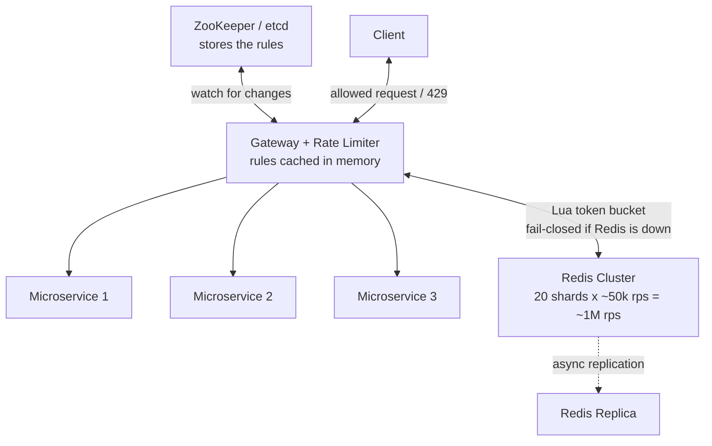
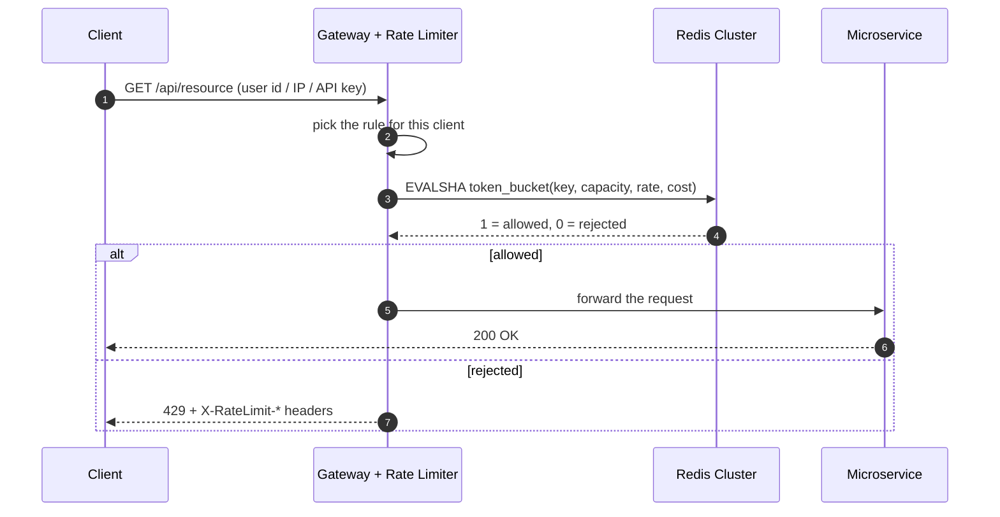
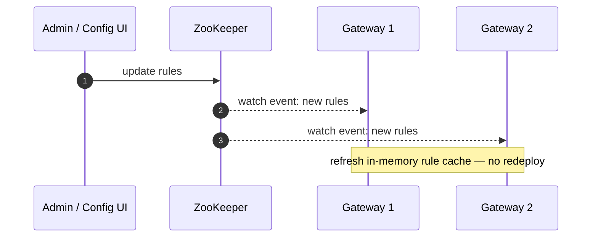

The [previous post](/posts/2026/09/rate-limiting-algorithms/) covered the **algorithms** — token bucket, leaky bucket, sliding windows — which decide *how* to count requests. This post is about the **system around them**: where to put the limiter, how to share state across many servers, how to change limits without a deploy, and what to do when the limiter itself goes down.

A **rate limiter** answers one question per request: *"is this client allowed to make this request right now?"* In a distributed system, that answer has to be consistent across every server.

## 1. Requirements

**Functional**

- **Dynamic rules** — change rate limits (per user, per endpoint, per tier) without redeploying.
- **Distributed** — the same limit applies across all servers.
- **Limit by identity** — user id, IP address, or API key.
- **Clear responses** — the right status code and headers when a request is rejected.

**Non-functional**

- **Token Bucket algorithm** — chosen for this design (see [why here](/posts/2026/09/rate-limiting-algorithms/)).
- **Server-side** — enforced on the server (at the gateway), never trusted to the client.
- **Availability over consistency** — a slightly stale counter is fine; a limiter outage is not.
- **Fail-closed** — if the limiter is completely unreachable, reject rather than let everything through.
- **Low latency** — under **10 ms** added per request.

## 2. Back-of-the-Envelope Estimation

Given **100 million daily active users** and **1 million requests per second (QPS)** at peak:

| What we're estimating | Calculation | Result |
|-----------------------|-------------|--------|
| Redis operations per second | Every request = at least 1 Redis call | ~1,000,000 ops/sec |
| Redis shards needed | 1M ÷ ~50k ops/sec per node | ~20 shards |
| State per client | tokens + timestamp ≈ 100 bytes | — |
| Total bucket state | 100M clients × ~100 bytes | ~10 GB |

Two conclusions:

1. **Redis must handle ~1M ops/sec.** With a Lua script on every request, plan for roughly **50k ops/sec per node** — so a cluster of about **20 shards**.
2. **~10 GB of bucket state** fits comfortably in that cluster — memory isn't the bottleneck; throughput is.

## 3. High-Level Design



The pieces:

- **Gateway (load balancer + rate limiter)** — every request passes through here first. The limiter runs *before* the request reaches any microservice, so bad traffic never touches expensive backends.
- **ZooKeeper / etcd** — stores the rate-limit rules. The gateway **watches** it, so rule changes reach every instance without a redeploy.
- **Redis cluster** — shared state (the token buckets), so all gateway instances see the same counts. About **20 shards** at ~50k requests/sec each cover the 1M rps target.
- **Redis replica** — keeps an asynchronous copy for failover without slowing down writes (see §7 and §10).
- **Connection pooling** — the gateway keeps fixed, persistent TCP connections to Redis and ZooKeeper so it never pays connection-setup cost per request.
- **429 response** — returned directly by the gateway when the limit is exceeded.

## 4. Request Flow



The whole rate-limit check is **one round trip** to Redis. Everything else (choosing the rule) happens in memory.

## 5. The Token Bucket, Atomically, in Redis

The token bucket needs to: refill based on elapsed time, check if a token exists, and consume it. If two requests do this at the same time, a naive implementation has a **race condition** and can let too many through.

**Solution:** run the whole operation as a **Lua script**. Redis runs scripts atomically (it's single-threaded), so no other command can sneak in between the refill and the decrement.

```lua
-- KEYS[1]: bucket key, e.g. "ratelimit:user:42"
-- ARGV[1]: capacity      (max tokens, i.e. max burst)
-- ARGV[2]: refill_rate   (tokens per second)
-- ARGV[3]: cost          (tokens this request costs; usually 1)

local capacity = tonumber(ARGV[1])
local rate     = tonumber(ARGV[2])
local cost     = tonumber(ARGV[3])

-- Use Redis's own clock so all servers agree on "now"
local t   = redis.call('TIME')
local now = tonumber(t[1]) + tonumber(t[2]) / 1000000

local data   = redis.call('HMGET', KEYS[1], 'tokens', 'ts')
local tokens = tonumber(data[1])
local ts     = tonumber(data[2])
if tokens == nil then
  tokens = capacity
  ts     = now
end

-- Refill lazily based on elapsed time, capped at capacity
local elapsed = math.max(0, now - ts)
tokens = math.min(capacity, tokens + elapsed * rate)

-- Decide and consume
local allowed = tokens >= cost
if allowed then
  tokens = tokens - cost
end

redis.call('HSET', KEYS[1], 'tokens', tokens, 'ts', now)

-- Expire the key once it could have fully refilled (keeps memory bounded)
local ttl_ms = math.ceil((capacity / rate) * 1000) + 1000
redis.call('PEXPIRE', KEYS[1], ttl_ms)

return allowed and 1 or 0
```

A few important details:

- **`redis.call('TIME')`** gives us the time from Redis itself, so gateway instances with slightly different clocks can't disagree. This avoids **clock skew** bugs.
- **`cost`** lets expensive requests cost more than one token (e.g. a heavy export costs 5).
- **`PEXPIRE`** deletes idle buckets after they could have refilled, so memory doesn't grow forever.
- **`EVALSHA`** runs a script that Redis has already cached by its SHA; the first call uses `EVAL` to load it, later calls `EVALSHA`. This avoids resending the script on every request.

## 6. Dynamic Rules with ZooKeeper

Limits must change without redeploying the limiter: think free vs paid tiers, or tightening a specific endpoint after abuse. Those rules need to reach **every** gateway quickly and consistently.

### What is ZooKeeper?

ZooKeeper is a **coordination service**: a small, highly available system whose only job is to store a little configuration/metadata and reliably tell many servers when it changes. Picture a shared bulletin board that thousands of servers can *watch* — when the board changes, the watchers get notified.

Things worth knowing:

- **It is not a database.** It stores small items (config, membership, locks), not application data.
- **Data is a tree of nodes (znodes)**, like a filesystem: `/config/ratelimit/free`. Each node holds a small value — here, a set of rules.
- **Watches are the key feature.** A client registers a *watch* on a node. When that node changes, ZooKeeper sends a one-time notification, and the client re-registers. That's how updates get pushed without polling.
- **It is strongly consistent.** It runs a consensus protocol (ZAB) behind a leader, so every client sees updates in the same order.
- **etcd** is the same idea (Kubernetes uses it); Consul or a small config service are alternatives.

### How a rule change propagates

Every gateway registers a watch on the rules node. When an operator changes the rules, ZooKeeper notifies each gateway, and each refreshes its **in-memory rule cache** — no redeploy, no restart.



Example rule set:

```yaml
rules:
  - match: { tier: free }
    capacity: 100
    refill_rate: 1.67        # ~100 requests / minute
  - match: { tier: paid }
    capacity: 10000
    refill_rate: 166.7       # ~10000 requests / minute
  - match: { path: /login, key_type: ip }
    capacity: 5
    refill_rate: 0.08        # ~5 requests / minute
```

Because rules are only read from memory at request time, looking one up costs essentially nothing.

### Why not store the rules in Redis?

Rules and counters have opposite needs:

- **Counters** change on every request (very hot) and care most about availability → Redis.
- **Rules** change rarely but must be consistent and ordered; a wrong rule is a real bug → ZooKeeper.

Keeping them separate means a Redis outage never loses the rules, and a rule rollout never adds load to the hot counter store.

## 7. Availability, Consistency, and Failing Safely

Two decisions define how the system behaves under stress.

### Availability over consistency (AP)

The counter is stored in Redis with **asynchronous replication**. If the master fails and a slightly-behind replica is promoted, a few recent increments can be lost — so a client might briefly get a few extra requests through (an *undercount*). That's acceptable: the goal is to *limit* abuse, not to be exact to the last request.

Choosing consistency instead — synchronous replication, where a write waits for a majority of replicas to confirm — would add latency and reduce availability. That's the wrong tradeoff for a limiter.

> **CAP theorem in one line:** when a network partition happens, a system must choose **consistency** (everyone sees the same data) or **availability** (everyone gets an answer). A rate limiter chooses **availability**.

### Fail-closed vs fail-open

If Redis is unreachable, the limiter must pick a default:

| Behavior | What happens | Effect |
|----------|--------------|--------|
| **Fail-open** | Let the request through | Keeps serving, but the backend is now unprotected |
| **Fail-closed** | Reject the request | Protects the backend, but a limiter outage can look like a full outage |

This design chooses **fail-closed**, because letting unlimited traffic hit the backend can take the whole system down. The cost is that Redis becomes critical infrastructure, so it must be highly available (cluster + replicas + automatic failover).

> A middle ground: keep a small **local fallback limiter** per gateway instance that takes over (roughly) if Redis is unreachable.

## 8. Responding When the Limit Is Hit

Rejected requests get a **`429 Too Many Requests`** with headers that tell the client how to recover:

```http
HTTP/1.1 429 Too Many Requests
Retry-After: 12
X-RateLimit-Limit: 100
X-RateLimit-Remaining: 0
X-RateLimit-Reset: 1699999999
Content-Type: application/json

{ "error": "rate_limit_exceeded", "message": "Too many requests. Try again in 12s." }
```

| Header | Meaning |
|--------|---------|
| `X-RateLimit-Limit` | The client's allowed limit for this window |
| `X-RateLimit-Remaining` | How many requests are left right now |
| `X-RateLimit-Reset` | Unix time when the limit resets |
| `Retry-After` | Seconds the client should wait before retrying |

Good headers turn a rejection from a mystery into something a client can handle gracefully.

## 9. Staying Under 10 ms

The latency budget is tight, so every avoidable cost is removed:

- **One Redis round trip.** The Lua script runs entirely server-side, so refill + check + decrement is a single network hop.
- **Persistent connections.** Connections to Redis and ZooKeeper are pooled and kept open.
- **Rules in memory.** Rules come from ZooKeeper push, not a lookup per request.
- **`EVALSHA`.** The script is cached in Redis; only its hash travels over the wire.
- **Proximity.** The limiter and Redis sit in the same region/availability zone, so the round trip is short.

Typical breakdown: picking a rule (<0.1 ms) + one Redis hop (~1–3 ms) + small overhead → comfortably **under 10 ms**.

## 10. Scaling Redis to ~1M ops/sec

- **Redis Cluster** splits keys across nodes, so throughput grows as you add shards.
- **~20 shards** cover ~1M ops/sec (at ~50k ops/sec per node), with **replicas** for failover.
- **Hash tags** — wrapping part of a key in `{}` (e.g. `ratelimit:{user:42}`) forces related keys onto the same shard, which helps when one operation must touch several keys together.
- **Watch for hot keys** — one wildly popular API key can overload a single shard. This is the same power-law problem discussed in the algorithms post.

## 11. Edge Cases and Pitfalls

- **Race conditions** — always do check-and-decrement atomically; use Lua.
- **Clock skew** — use Redis `TIME` instead of each server's clock.
- **Hot keys** — a single key getting huge traffic can saturate one shard; shard or split it.
- **Memory growth** — expire buckets with a TTL; otherwise idle keys pile up forever.
- **Rule propagation delay** — new limits take a moment to reach every instance; accept eventual consistency.
- **Fail-closed risk** — make Redis highly available, or keep a local fallback so a Redis blip doesn't reject everything.
- **Identity choice** — decide up front whether to key on user id, IP, or API key; each has different fairness and privacy tradeoffs.

## 12. Tradeoffs at a Glance

| Decision | Tradeoff |
|----------|----------|
| Availability over consistency | Simpler, faster, but a client may briefly exceed its limit |
| Fail-closed | Protects the backend, but makes Redis a critical dependency |
| Centralized Redis | Accurate and shared, but adds a network hop and a single point of failure (SPOF) |
| Rules in ZooKeeper | Live updates, but rule changes propagate eventually, not instantly |
| Rate limit at the gateway | Blocks bad traffic early, but makes the gateway a critical path |

## Key Takeaways

1. **Rate limiting belongs on the server, at the gateway** — reject before requests reach your services.
2. **Token Bucket in a Redis cluster** gives one shared, burst-friendly limiter for all servers.
3. **Do the whole check in a Lua script** so it's atomic — no race conditions.
4. **Use Redis `TIME`** so all servers agree on "now".
5. **ZooKeeper watches push dynamic rules** to every instance, so limits change without a deploy.
6. **Choose availability and fail-closed deliberately** — they shape what happens during an outage.
7. **Pool connections and cache rules** to keep the added latency under 10 ms.

## Mini Glossary

| Term | Meaning |
|------|---------|
| QPS | Queries (requests) per second |
| Shard | A slice of data on its own machine; many shards share the load |
| Redis Cluster | Redis split across several shards by key |
| Lua script | Code Redis runs atomically on the server |
| `EVALSHA` | Run a script cached in Redis by its hash |
| ZooKeeper | A coordination service that stores small config and notifies watchers of changes |
| Znode | A node in ZooKeeper's tree, like a file holding a small value |
| Watch | A one-time notification a client registers on a ZooKeeper node |
| etcd | A ZooKeeper-like coordination service (used by Kubernetes) |
| CAP theorem | Under a partition, choose consistency or availability (not both) |
| Fail-open | Allow traffic when the limiter is down |
| Fail-closed | Reject traffic when the limiter is down |
| SPOF | Single point of failure — one component whose failure takes down the system |
| Clock skew | Different servers having slightly different times |
| Hot key | One key receiving a disproportionate share of traffic |