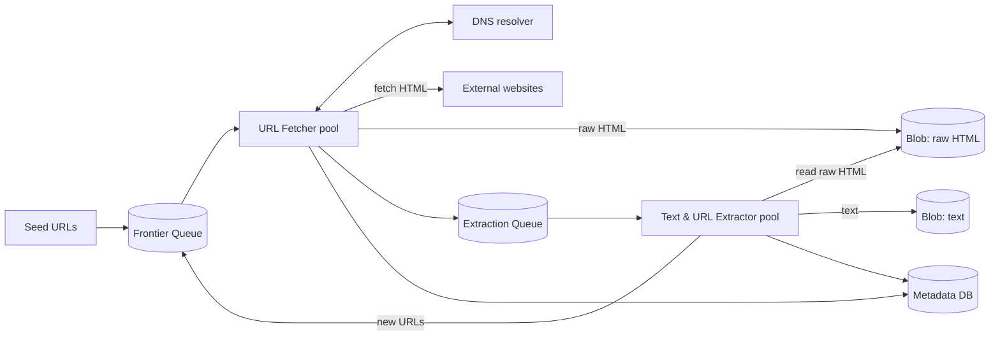
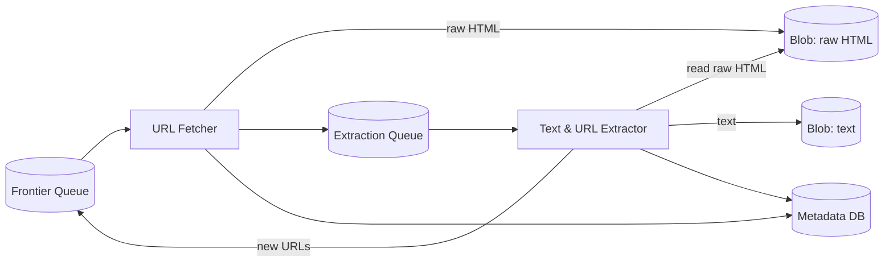
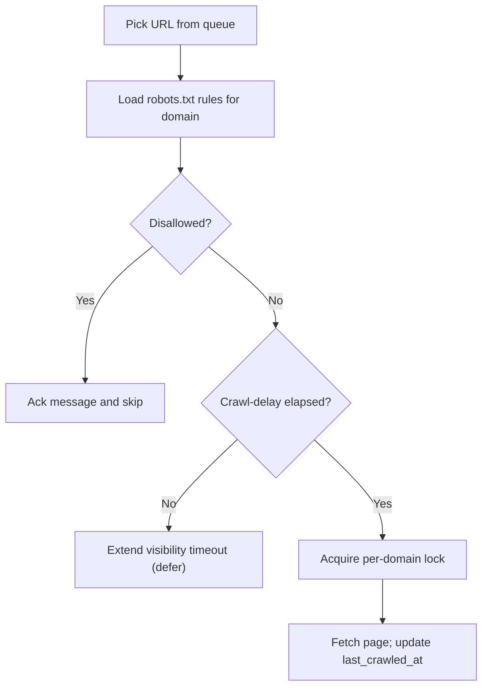

A **web crawler** (or "spider") is a program that automatically walks the web: it downloads a page, pulls out the useful data and the links on that page, then follows those links to more pages, and repeats. Search engines use crawlers to index the web; AI companies use them to gather text for training models.

In this post we'll design a crawler whose job is to **collect text data from the web** for later ML training. We'll keep the main design at a solid mid-level depth, then briefly note where a senior engineer would go deeper.

## 1. Requirements

**Functional**

- **Crawl** the web starting from a set of **seed URLs** (a starting list of pages).
- **Extract** the text from each page and store it for later use.

**Out of scope**

- Training the model itself, and processing images/videos.
- JavaScript-rendered pages and login-protected pages.

**Non-functional**

- **Fault tolerant** — survive failures and resume without losing progress.
- **Polite** — obey `robots.txt` and don't overwhelm websites.
- **Efficient** — crawl ~10 billion pages within 5 days.
- **Scalable** — handle 10 billion pages and millions of domains.

## 2. Back-of-the-Envelope Estimation

We're told there are about **10 billion pages**, averaging **~2 MB** each (including inline resources), and we have **5 days** to finish.

The crawl is **I/O bound** — the bottleneck is network bandwidth, not CPU. A network-optimized machine can push about **200 Gbps**, which is roughly:

```text
200 Gbps ÷ 8 bits/byte ÷ 2 MB per page ≈ 12,500 pages/sec (theoretical)
```

In practice we won't use all of that. Assume we use ~30%:

```text
12,500 × 30% ≈ 3,750 pages/sec per machine
```

| What we're estimating | Calculation | Result |
|-----------------------|-------------|--------|
| Time on one machine | 10,000,000,000 ÷ 3,750 | ~2.67M sec ≈ **31 days** |
| Machines needed | 31 days ÷ 5 days | ~**8 machines** |
| Metadata rows | 10B URLs × ~1 KB | ~**10 TB** |
| Raw HTML stored | 10B × 2 MB | ~**20 PB** |

Two conclusions:

1. We need roughly **8 high-bandwidth machines** to hit the deadline.
2. **Blob storage must be cheap and huge** — 20 PB is far beyond what a normal database should hold, which is why raw pages go to S3.

> The exact numbers depend on real-world limits (latency, politeness, retries). What matters is the *reasoning*.

## 3. System Interface and Data Flow

This isn't a user-facing system, so instead of a REST API we define its **boundary**: what goes in and what comes out.

- **Input:** a batch of seed URLs.
- **Output:** extracted text (plus metadata) stored for the ML pipeline to consume.

For each page, the data flow is:

1. Take a URL from the **frontier** (the queue of URLs waiting to be crawled).
2. Resolve its domain to an IP address via **DNS**.
3. Fetch the HTML from the website.
4. Extract the text and store it.
5. Extract the links on the page and add them back to the frontier.
6. Repeat until there are no URLs left.

## 4. Data Model

We keep a small **Metadata DB** (DynamoDB or PostgreSQL both work) to track what we've seen and where the big files live. Big files themselves go to blob storage — never in the database or the queue.

```sql
CREATE TABLE urls (
    url_id          BIGSERIAL PRIMARY KEY,
    url             TEXT NOT NULL UNIQUE,
    domain          TEXT NOT NULL,
    depth           INT  NOT NULL DEFAULT 0,      -- link hops from a seed
    status          TEXT NOT NULL DEFAULT 'pending',
    content_hash    TEXT,                          -- hash of fetched content
    html_blob_key   TEXT,                          -- where raw HTML lives
    text_blob_key   TEXT,                          -- where extracted text lives
    last_crawled_at TIMESTAMP
);

CREATE TABLE domains (
    domain             TEXT PRIMARY KEY,
    robots_txt         TEXT,                       -- cached robots.txt
    crawl_delay_secs   INT DEFAULT 1,
    last_crawled_at    TIMESTAMP
);
```

- `url` is **unique**, which gives us URL-level de-duplication for free.
- `depth` guards against crawler traps (more on this later).
- `status` tracks progress: `pending → fetched → extracted` (or `failed`).
- `content_hash` lets us spot duplicate *content* served under different URLs.
- The `domains` table stores each site's `robots.txt`, its crawl-delay, and when we last hit it — this is what keeps us polite.

## 5. High-Level Architecture



The pieces:

- **Frontier Queue** — the queue of URLs still to crawl. Start with the seed URLs and add new links as we go.
- **URL Fetcher pool** — fetches HTML from websites and stores it in blob storage.
- **DNS resolver** — turns domain names into IP addresses; a hidden bottleneck at scale.
- **Extraction Queue** — hands fetched pages to the parsing stage.
- **Text & URL Extractor pool** — reads the raw HTML, extracts text, and finds new links.
- **Metadata DB** — small records: which URLs are done, their depth, content hash, and blob keys.
- **Blob storage (S3)** — the raw HTML and extracted text (the ~20 PB from above).

> **Why two stages instead of one crawler?** A single "fetch + parse" worker is fragile: if the fetch fails, all progress is lost. Splitting into stages isolates failures and lets each stage scale on its own — see §6.

## 6. Crawl Flow

```mermaid
sequenceDiagram
    autonumber
    participant FQ as Frontier Queue
    participant F as URL Fetcher
    participant DNS as DNS
    participant W as Website
    participant DB as Metadata DB
    participant B as Blob Storage
    participant EQ as Extraction Queue
    participant X as Extractor

    FQ->>F: deliver URL message (id)
    F->>DB: already crawled? domain rules?
    DB-->>F: not seen; robots.txt + crawl-delay
    F->>DNS: resolve domain
    DNS-->>F: IP address
    F->>W: GET page (respecting politeness)
    W-->>F: HTML
    F->>B: store raw HTML
    F->>DB: mark fetched (html key, content hash)
    F->>EQ: enqueue url_id
    F->>FQ: delete message (ack)
    EQ->>X: deliver url_id
    X->>B: read raw HTML
    X->>B: store extracted text
    X->>DB: mark extracted (text key)
    X->>FQ: enqueue discovered URLs
    X->>EQ: delete message (ack)
```

Notice that a queue message is only deleted (**acked**) after its work is durably stored. If a worker crashes mid-task, the message reappears and another worker picks it up — that's the core of fault tolerance.

## 7. Fault Tolerance: the Crawler Pipeline

Splitting the crawler into two stages gives us:

1. **URL Fetcher** — fetches HTML and saves the raw HTML to blob storage.
2. **Text & URL Extractor** — reads the HTML, extracts the text, and pulls out new links.



Why this matters:

- A fetch failure is retried **without re-doing** the parsing stage.
- Each stage **scales independently** (fetching is bandwidth-bound, parsing is CPU-bound).
- The extraction step can be **changed later** (e.g. also keep image alt text) without re-fetching the web — just re-run the parser over the stored HTML.

Queues keep a message until the work is **confirmed done**. Two common mechanisms:

- **SQS** hides a message while a worker processes it (the **visibility timeout**); if the worker never deletes it, it reappears for someone else.
- **Kafka** keeps messages in a log and workers track their position (an **offset**); a crash just resumes from the last committed position.

## 8. Retries, Backoff, and the Dead-Letter Queue

Some failures are temporary: a site is slow, briefly down, or the connection dropped. Retrying immediately makes things worse, so use **exponential backoff** — wait a little, then longer each time (1s, 2s, 4s, 8s…).

- With **SQS**, extend the visibility timeout using `ChangeMessageVisibility` so the message stays hidden until it's worth retrying.
- If a URL keeps failing, send it to a **dead-letter queue (DLQ)** after a set number of attempts (`maxReceiveCount`) and mark the site offline for now.

This keeps transient failures from blocking the queue and keeps permanently broken URLs out of the way.

## 9. Politeness: `robots.txt` and Rate Limiting

**Politeness** means not hammering other people's servers. Before crawling a page, check the site's **`robots.txt`**, a file that tells crawlers what they may access and how often:

```text
User-agent: *
Disallow: /private/
Crawl-delay: 10
```

- `User-agent: *` — applies to all crawlers.
- `Disallow: /private/` — don't crawl pages under `/private/`.
- `Crawl-delay: 10` — wait 10 seconds between requests to this site.



The industry norm is also to keep requests to any single domain at **~1 per second**. Because many crawlers run in parallel, they can accidentally hit the same domain at once. Two fixes:

- A **per-domain lock** (e.g. Redis `SET key value NX` with a short TTL) so only one crawler works a domain at a time.
- **Jitter** — a small random delay so crawlers don't all retry at the exact same instant.

## 10. De-duplication: Don't Crawl Twice

Wasting bandwidth on pages we've already seen is the biggest efficiency killer. Two levels of protection:

### 10.1 URL-level de-duplication

Before putting a URL on the frontier, look it up in the `urls` table. If it's already there, skip it. The unique index on `url` makes this cheap. This is your first line of defense.

### 10.2 Content-level de-duplication

Different URLs often serve identical content — `example.com` vs `www.example.com`, or the same article mirrored across domains. URLs won't catch that, so hash the page **content** after fetching and compare:

```python
import hashlib

def content_hash(html: bytes) -> str:
    return hashlib.sha256(html).hexdigest()
```

| Approach | How it works | Tradeoff |
|----------|--------------|----------|
| **Hash index in Metadata DB** | Store `content_hash`, check with an index | Simple and exact; index grows large |
| **Bloom filter** | Probabilistic set of seen hashes | Tiny memory, very fast; can false-positive (rarely skips a new page) |

For mid-level, the **hash index** is the practical choice; a Bloom filter is the scale-driven optimization worth mentioning.

## 11. Avoiding Crawler Traps

A **crawler trap** is a page that keeps crawlers looping forever — for example, a calendar that links to an infinite chain of "next day" pages. Without a guard, the crawler never finishes.

The fix is a **maximum crawl depth**: the number of link hops from a seed. A seed is depth 0, pages linked from it are depth 1, and so on. Increment `depth` each time we follow a link, and stop that branch once it passes a threshold (say 15–20).

## 12. Scaling to 10 Billion Pages

- **Parallelize.** Many fetcher machines, each holding thousands of connections to *different* domains. Any single domain still sees ~1 request/sec, but the total across millions of domains is huge.
- **Auto-scale the extractor pool** based on the extraction queue length, so parsing keeps pace with fetching.
- **Don't forget DNS.** At thousands of requests/sec across millions of domains, DNS resolution becomes a real bottleneck (studies of early crawlers found lookups consuming a large share of a thread's time). Mitigate with:
  - **DNS caching** — reuse a domain's lookup across URLs.
  - **Multiple DNS providers** — round-robin between them to spread the load and avoid rate limits.

## 13. Availability and Fault Tolerance

- **Queues and blob storage are managed** (SQS, S3) — they replicate and survive failures for us.
- **Metadata DB is replicated** (e.g. DynamoDB or a multi-AZ SQL setup).
- **Fetchers and extractors are stateless** — if one dies, the queue simply redelivers its message to another.
- **DNS is redundant** — cache lookups and use more than one provider.
- **Redelivery is the recovery mechanism** — nothing is acked until it's safely stored.

## 14. Edge Cases and Pitfalls

- **Slow or hanging sites** — use fetch timeouts so one site can't stall a worker.
- **Large files** — send a `HEAD` request first and skip files above a size threshold without downloading them.
- **Redirects** — follow them, but cap the chain to avoid loops.
- **Non-200 responses** — treat 4xx as permanent (don't retry forever), 5xx as transient (retry with backoff).
- **Duplicate content** — handled by content hashing (§10).
- **`robots.txt` changes** — re-fetch it periodically, not just once.
- **Lock contention** — if a popular domain is always locked, defer those URLs with jitter so workers don't spin.
- **Crawler traps** — capped by max depth (§11).

## 15. Going Further (Senior-Level, Briefly)

Worth knowing, but you don't need deep detail at mid-level:

- **Dynamic content** — JavaScript-rendered pages need a **headless browser** (e.g. Puppeteer), which is far heavier than fetching HTML.
- **Ongoing crawls** — for a search engine that refreshes the web, add a **URL Scheduler** that decides *when* to re-crawl a page based on last-crawl time and popularity.
- **Priority crawling** — popular domains first, using separate high/low priority queues (or topics).
- **Distributed dedup at scale** — shard the Bloom filter or hash index so it isn't a single hot component.
- **Monitoring** — track queue depth, fetch success rate, and pages/sec per stage to spot bottlenecks early.

## 16. Tradeoffs at a Glance

| Decision | Tradeoff |
|----------|----------|
| Queue: SQS vs Kafka | SQS is managed and handles retries/DLQ simply; Kafka gives more control and throughput but more to operate |
| Hash index vs Bloom filter | Index is simple and exact; Bloom filter is smaller/faster but can false-positive |
| Fetch + parse together vs staged | Staged is more fault tolerant and flexible, but adds queues and coordination |
| Aggressive vs polite crawling | Faster to finish, but risks harming real sites (and getting blocked) |
| Metadata DB: NoSQL vs SQL | NoSQL scales easily; SQL gives richer queries and transactions |
| Blob storage vs database for pages | Blob storage is cheap and huge; databases aren't built for petabytes |

## Key Takeaways

1. A crawler is a **pipeline**: frontier queue → fetch → extract → store → follow links.
2. **Split fetching and parsing into stages** so failures are isolated and each stage scales on its own.
3. Keep big data in **blob storage**; queues carry only small IDs and metadata.
4. Be **polite**: obey `robots.txt`, respect crawl-delay, and rate-limit per domain (with jitter).
5. **Retry with exponential backoff**, then park permanent failures in a **DLQ**.
6. The crawl is **I/O bound** — sizing comes from bandwidth, and **DNS** is an easy-to-miss bottleneck.
7. Avoid wasted work with **URL de-duplication**, and add **content hashing** for duplicate pages.
8. Guard against **crawler traps** with a maximum depth.

## Mini Glossary

| Term | Meaning |
|------|---------|
| Crawler / spider | A program that walks the web by following links |
| Seed URLs | The starting list of pages to crawl |
| Frontier | The queue of URLs waiting to be crawled |
| `robots.txt` | A file telling crawlers what they may access and how often |
| Crawl-delay | The delay a site asks crawlers to wait between requests |
| Visibility timeout | Time a queue hides a message while a worker processes it |
| Dead-letter queue (DLQ) | Where messages go after too many failed attempts |
| Exponential backoff | Waiting longer after each retry |
| Jitter | Small random delay to avoid synchronized retries |
| Blob storage | Cheap storage for large files (e.g. S3) |
| Content hash | A fingerprint of a page used to detect duplicate content |
| Bloom filter | A compact, probabilistic "have I seen this?" structure |
| Crawler trap | A page that keeps crawlers looping forever |