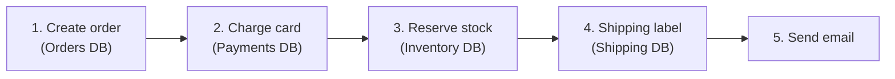
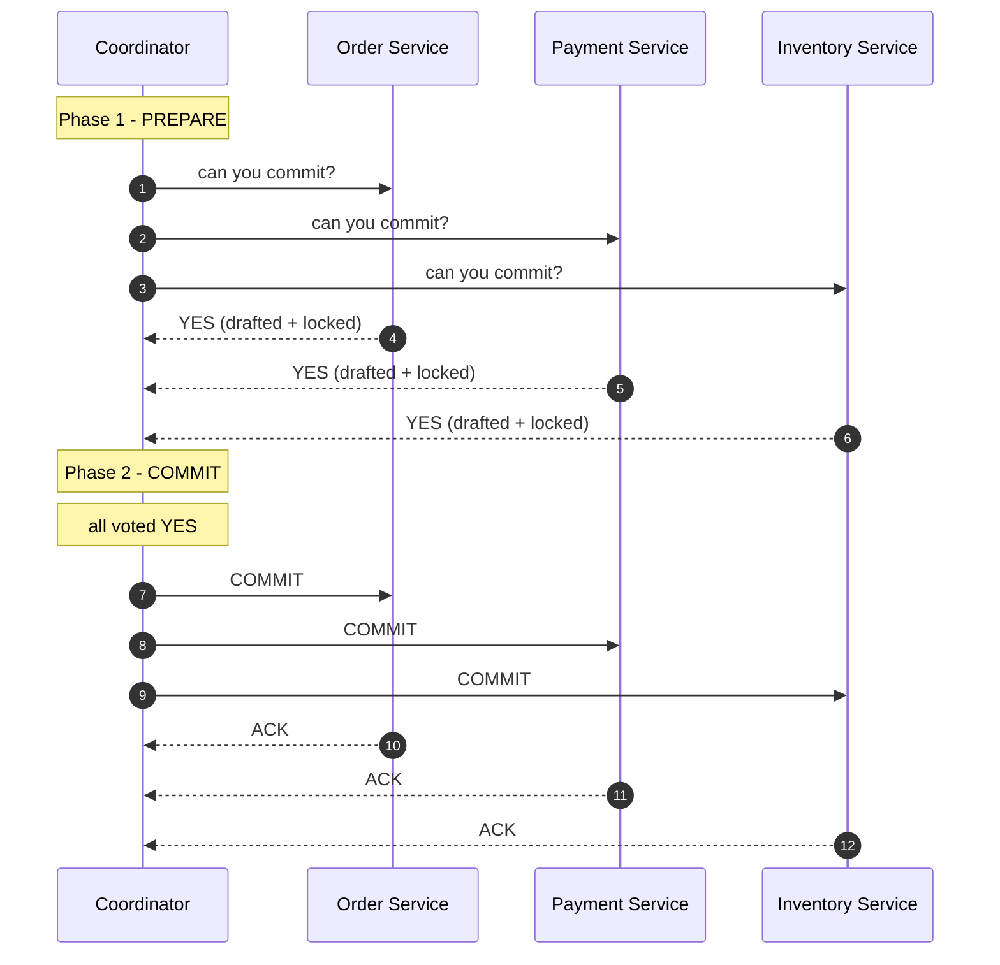
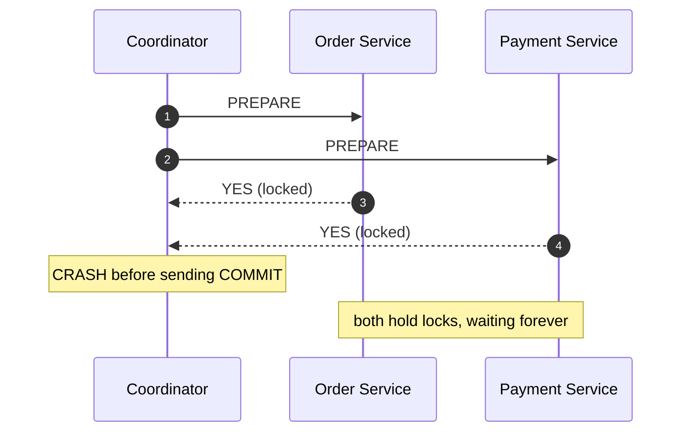
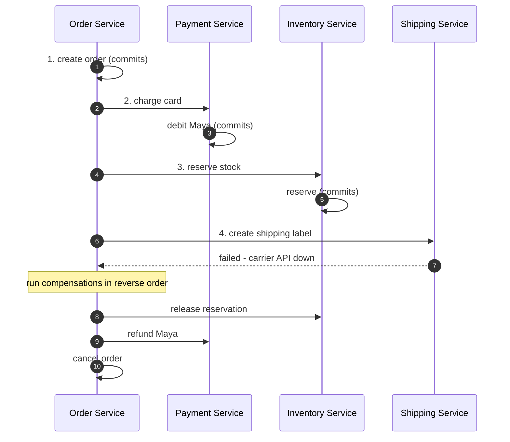
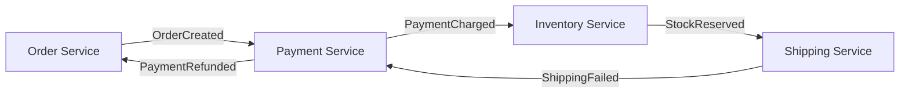
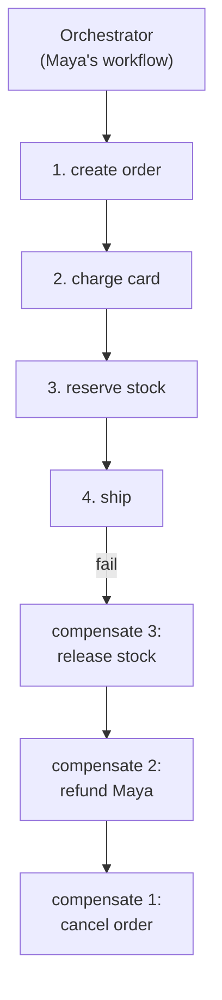
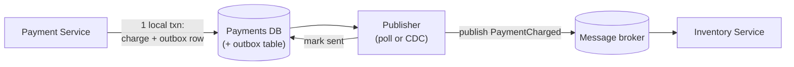

This post is a story. Meet **Maya**. She just clicked **"Buy"** on a laptop at an online store. That one click has to do five things:

1. **Create the order** — Order Service (Orders DB)
2. **Charge her card** — Payment Service (Payments DB)
3. **Reserve the laptop** — Inventory Service (Inventory DB)
4. **Create a shipping label** — Shipping Service (Shipping DB)
5. **Send the confirmation email**

Each step is a different microservice with its **own database on its own machine**. We'll follow Maya's order through every topic in this post, and watch what happens when things go wrong.

## 1. The Core Problem

### A transaction in a single database

Start small. In a monolith with one database, a **transaction** is a group of operations that must all succeed or all fail. The database gives us **ACID**:

- **Atomicity** — all operations commit together, or none do.
- **Consistency** — the database moves from one valid state to another.
- **Isolation** — uncommitted changes are hidden from other transactions.
- **Durability** — once committed, changes survive a crash.

If something fails halfway, the engine **rolls back** for us. We never think about it.

### Maya's order, spread across four databases

Now Maya's order is split into microservices:



Let's watch the happy path: Maya clicks Buy.

- **Step 1** — Order Service writes an order, commits. ✅
- **Step 2** — Payment Service charges her card, commits. ✅
- **Step 3** — Inventory Service reserves the laptop, commits. ✅
- **Step 4** — Shipping Service calls the carrier… **the carrier API is down.** ❌

Now we're stuck. Steps 1–3 are already committed in three other databases. There's **no engine that can roll them back** — those commits happened on separate machines. Maya has been charged for an order we can't ship.

> **ACID guarantees do not survive service boundaries.**

> A **distributed transaction** is one logical operation spanning multiple independent databases that must either all succeed or fail cleanly, without corrupting state.

The hard part isn't the happy path — it's exactly what you just saw: **a failure in the middle, with no shared rollback.**

## 2. Two-Phase Commit (2PC)

The first attempt to fix Maya's order is **2PC**. It brings back atomicity with a central **coordinator** (a transaction manager) that drives all the **participants**.

### The idea, told in steps

**Step 1 — Ask everyone to prepare.** The coordinator asks each service: *"can you commit?"* Each service does its local work, **locks the rows** it touched, and votes.

- Order Service: "yes, order drafted and locked."
- Payment Service: "yes, charge drafted and locked."
- Inventory Service: "yes, reservation drafted and locked."
- Shipping Service: "no — carrier API is down."

**Step 2 — Decide.** If **everyone** voted yes, the coordinator says *commit*. If **anyone** voted no (or timed out), everyone rolls back.

So for Maya, Shipping's "no" means every service rolls back and releases its lock — clean, no charge, no reservation.



That's the dream: all participants commit at the same logical instant, so it's atomic.

### Where it breaks — the crash in Maya's story

Now replay the story with one cruel change. All four services vote **yes**. The coordinator is about to send *commit*… and **it crashes**.



The services don't know whether to commit or abort, so they **hold their locks indefinitely** until the coordinator comes back. Meanwhile:

- Maya's order row is locked — she can't edit or cancel it.
- Her payment row is locked — any other charge for her account waits.
- Every new order touching those rows **blocks too.**

This is **resource starvation**. One crash stalls unrelated customers. That's why 2PC is considered a **blocking protocol**, and why it's rarely used across independent microservices.

### Where 2PC still lives

*Inside* tightly-coupled distributed databases like **Google Spanner** and **CockroachDB**, where latency is low, the environment is controlled, and the database runs the protocol for you over its own replicas.

## 3. The Saga Pattern

The second attempt flips the idea: don't lock everything until the end. Instead, break Maya's order into a **chain of local transactions**, each committing immediately. If a later step fails, undo the earlier ones with **business-level compensations**.

Think: *"one transaction per service, plus an undo for each."*

### Maya's order, saga-style, told in steps

- **Step 1** — Order Service creates the order and **commits**. ✅
- **Step 2** — Payment Service charges Maya and **commits**. ✅
- **Step 3** — Inventory Service reserves the laptop and **commits**. ✅
- **Step 4** — Shipping Service fails. ❌

Now walk **backwards** and run a compensation for each committed step:

- **Compensate Step 3** — Inventory: release the reservation.
- **Compensate Step 2** — Payment: refund Maya.
- **Compensate Step 1** — Order: cancel the order.



### Compensations are business actions, not rollbacks

Here's the mental shift. There is no database "undo" — Maya was really charged. The undo has to be a *new business action*:

| Forward step | Compensating action |
|--------------|---------------------|
| Charge Maya's card | Refund Maya |
| Reserve the laptop | Release the reservation |
| Create the order | Cancel the order |
| Book a seat | Release the seat |

And two rules make sagas reliable:

- **Idempotent** — a step or compensation must be safe to run **more than once** (networks retry). Use an **idempotency key** so a duplicate "refund Maya" becomes a no-op instead of refunding twice.
- **Retryable** — steps and compensations need retry logic with **exponential backoff**.

### The price: eventual consistency, visible undo

With a saga, there's a window where **Maya has been charged but nothing has shipped**. That interim state is visible. And the undo can be too — Maya might get a "your refund is on the way" notification minutes after the charge.

Choosing a saga means accepting: *"eventually consistent, with a visible undo."* For many businesses (and for Maya) that's a perfectly reasonable trade.

## 4. Coordinating a Saga: Who Runs the Story?

Someone has to decide which step comes next and trigger compensations when things fail. Two styles.

### Choreography: the services tell the story through events

Each service does its work and **publishes an event**; the next service listens and reacts. No central controller.

Follow Maya's order through events:

- Order Service publishes `OrderCreated` → Payment listens.
- Payment charges, publishes `PaymentCharged` → Inventory listens.
- Inventory reserves, publishes `StockReserved` → Shipping listens.
- Shipping fails, publishes `ShippingFailed` → Payment and Order listen and compensate.



- **Good:** simple to start, loosely coupled.
- **Bad:** as services multiply, the flow becomes an invisible spider web. **Nobody can see the state of Maya's order** or reason about it. Debugging is painful.

### Orchestration: one conductor for Maya's order

A dedicated **orchestrator** tells each service what to do, in order, and triggers compensations when a step fails.



- **Good:** the whole story of Maya's order lives in one place — easy to observe, retry, and change.
- **Bad:** it's another service to run (more coupling than pure events).

### Durable execution: what if the conductor faints?

The obvious worry: *if the orchestrator crashes mid-story, don't we lose Maya's order again?*

Modern **workflow engines** solve this with **durable execution**. You write the saga as ordinary code, and the engine:

- **Persists an event history** of every completed step in a database.
- On a crash, starts a fresh worker and **replays** that history to rebuild state, resuming exactly where it stopped.
- Retries failed steps automatically.

Walk it: orchestrator completes steps 1–2, then crashes. A new worker replays "order created, card charged", and continues at step 3. Maya never notices.

**Examples:** Temporal, AWS Step Functions, Cadence, Restate. This is the current industry default for reliable multi-step workflows.

| Aspect | Choreography | Orchestration |
|--------|--------------|---------------|
| Control | Decentralized, event-driven | Central orchestrator |
| Coupling | Loose; no one sees the whole flow | Orchestrator knows every step |
| Visibility | Hard to trace as it grows | One place to see saga state |
| Failure handling | Each service reacts to events | Orchestrator triggers compensations |
| Durability | You build it yourself | Engine provides durable execution |
| Examples | Event-driven systems | Temporal, Step Functions |

## 5. The Dual-Write Problem and the Outbox Pattern

There's one more failure hiding in Maya's story, and it's sneaky.

### A subtle failure in Maya's story

When Payment Service charges Maya, it must do **two things**: write the charge to the Payments DB *and* publish a `PaymentCharged` event so Inventory knows to reserve the laptop. That's the **dual-write problem**.

```python
db.save(charge)              # 1. succeeds
broker.publish("PaymentCharged")  # 2. crashes here -> event lost forever
```

Maya is charged, but Inventory **never hears about it**, so the laptop is never reserved. The two writes can't be made atomic because they're different systems.

### The fix: the transactional outbox, retold in steps

Make the event part of the **same local transaction** as the data:

- **Step 1** — In one local transaction, Payment Service writes the charge **and** inserts a `PaymentCharged` row into an **outbox table**. They commit together — both or neither.
- **Step 2** — A background publisher reads the outbox, publishes to the broker (by **polling** or **Change Data Capture / CDC**), and marks the row sent.

So even if Payment Service crashes right after step 1, the event is safely sitting in the outbox and will be published once it recovers.



```sql
CREATE TABLE outbox (
    id          BIGSERIAL PRIMARY KEY,
    aggregate   TEXT NOT NULL,
    event_type  TEXT NOT NULL,
    payload     JSONB NOT NULL,
    created_at  TIMESTAMP DEFAULT now(),
    published   BOOLEAN NOT NULL DEFAULT false
);
```

```python
def publish_pending():
    # runs in a background worker
    while True:
        rows = db.query(
            "SELECT * FROM outbox WHERE published = false "
            "ORDER BY id LIMIT 100 FOR UPDATE SKIP LOCKED"
        )
        for row in rows:
            broker.publish(row.event_type, row.payload)  # consumers must be idempotent
            db.execute("UPDATE outbox SET published = true WHERE id = %s", row.id)
        time.sleep(1)
```

Because publishing happens *after* the commit, an event can be sent **more than once** — so Inventory must be **idempotent** (dedupe on the event id). This "at-least-once delivery + idempotent consumer" is how systems get *effectively-once* behavior.

## 6. Failure Deep Dives — "What If…" for Maya's Order

### "What if the process running my saga crashes partway through?"

With **choreography**, each service only knows its own state, so a crash can strand Maya's order. With **durable execution**, the engine persisted the history, so a fresh worker **replays** it and resumes. That's the main reason teams pick an orchestration engine over hand-rolled events.

### "How do I make sure a step runs exactly once?"

True exactly-once over a network is unrealistic. The practical recipe is:

- **At-least-once** delivery (retries), plus
- **Idempotency keys** on every step, compensation, and event consumer.

That gives **effectively-once**: duplicates are harmless.

### "What if a step takes hours or days?"

"Wait for the warehouse to pick the laptop" or "wait for the payment gateway's webhook" can take a long time. A workflow engine **suspends** Maya's workflow and resumes it on a timer or an incoming event — without holding a thread or a lock. Hand-rolled versions use delay queues and status flags.

### "What if we change the order flow later?"

Workflows evolve, but old in-flight orders already have a persisted history. Engines handle this with **workflow versioning**: branch on a version marker so old histories replay with the old logic, while new orders use the new logic.

## 7. The Golden Rule

Before reaching for any of this, remember:

> **Design service boundaries so that data which transacts together lives in the same database.**

If "charge Maya" and "record the charge" live in one service with one database, there's no distributed transaction to manage. Most distributed-transaction problems are really **boundary-design problems** in disguise.

When you genuinely can't avoid it:

- **Within one distributed database** (Spanner, CockroachDB) → **2PC** is fine.
- **Across independent microservices** → **Saga** (usually **orchestrated** with durable execution), with an **Outbox** to emit events reliably.

## 8. Tradeoffs at a Glance

| Aspect | 2PC | Saga |
|--------|-----|------|
| Consistency | Strong (atomic) | Eventual |
| Locks | Held across phases — **blocking** | Only short local transactions |
| Failure handling | Coordinator recovery; risk of stuck locks | Compensating actions + retries |
| Coupling / latency | Tight, low latency | Loose, async |
| Visibility of interim state | Hidden | Visible (needs care) |
| Complexity you own | Low (in a distributed DB) | Higher (orchestration, idempotency) |
| Best for | A single distributed DB | Business workflows across services |

## 9. Going Further (Senior-Level, Briefly)

- **Isolation in sagas** — interim states are visible; use **semantic locks** or a `PENDING` status so other readers know a step is in flight.
- **Ordering** — outbox events must be ordered per aggregate, so Maya's `PaymentCharged` can't overtake her `OrderCreated`.
- **Irreversible steps** — once an email is sent or a package ships, compensate with a follow-up action, not an undo.
- **Workflow state size** — keep large payloads in blob storage and pass references, so the history stays small.
- **3PC and consensus** — three-phase commit and Paxos/Raft-based commit reduce blocking in theory; in practice, teams choose Spanner-style commit or Sagas.

## Key Takeaways

1. **ACID is free in one database; it isn't across microservices.** Maya's order can't be atomically rolled back once it spans four DBs.
2. **2PC** restores atomicity but is **blocking** — a coordinator crash leaves participants holding locks. Mostly used *inside* distributed databases.
3. **Saga** splits work into **local transactions with compensating actions**, trading strong consistency for **eventual consistency**.
4. Compensations must be **idempotent and retryable**; they're business actions (refunds), not database rollbacks.
5. Prefer **orchestration with durable execution** (Temporal, Step Functions) over hand-rolled choreography once flows get complex.
6. Solve the **dual-write problem** with the **transactional outbox**, and make consumers idempotent.
7. **The best fix is architectural** — co-locate data that must be consistent and avoid the distributed transaction entirely.

## Mini Glossary

| Term | Meaning |
|------|---------|
| ACID | Atomicity, Consistency, Isolation, Durability — single-DB guarantees |
| Distributed transaction | One logical operation across multiple databases |
| Coordinator | The component driving a 2PC protocol |
| Participant | A database/service taking part in 2PC |
| 2PC | Two-phase commit — prepare, then commit or abort |
| Blocking protocol | Locks held until recovery; can stall other work |
| Saga | A chain of local transactions with compensations |
| Compensating action | A business-level undo (e.g. refund instead of rollback) |
| Idempotent | Safe to run multiple times with the same effect |
| Eventual consistency | Replicas converge over time, not instantly |
| Dual-write problem | A DB write and an event publish can't both be atomic |
| Outbox pattern | Store the event in the DB in the same transaction, publish later |
| CDC | Change Data Capture — stream DB changes as events |
| Choreography | Decentralized, event-driven coordination |
| Orchestration | A central service driving each step |
| Durable execution | A workflow engine persists history and replays to recover |
| Semantic lock | A `PENDING` flag marking a row mid-saga |