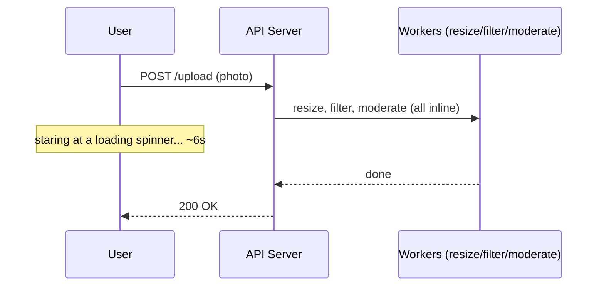
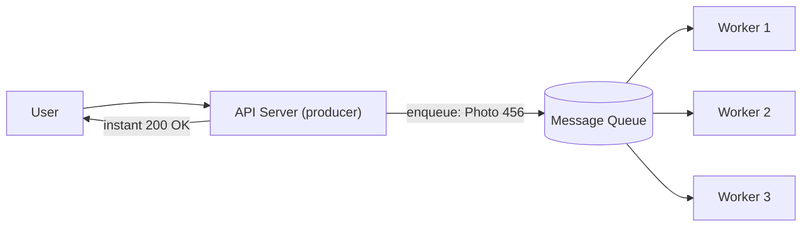
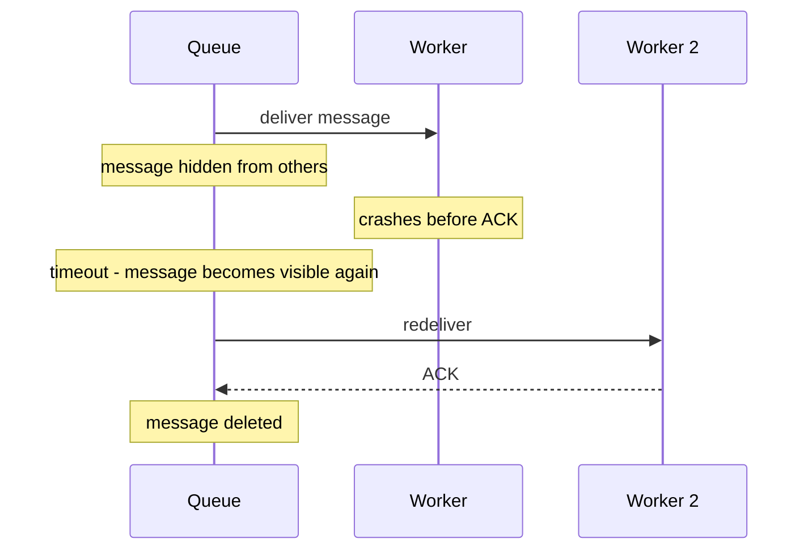
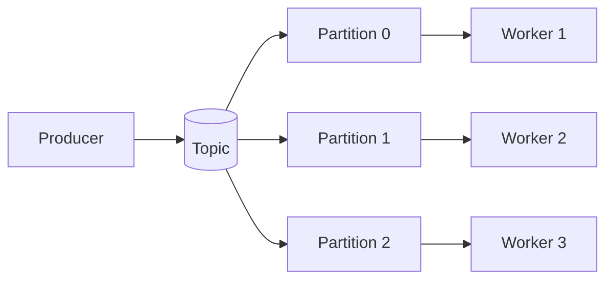
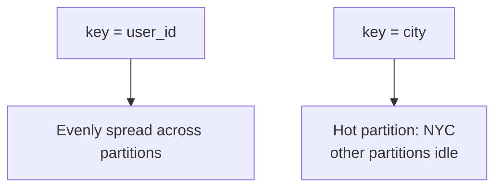

Imagine a photo-sharing app. A user uploads a photo, and the server has to **resize it, apply filters, and run content moderation**. We'll follow that upload through this post and watch a naive design fall over — then fix it with a **message queue**.

Queues show up everywhere (emails, notifications, image processing, order pipelines), so understanding them is core system design. We'll cover what they are, how they behave under failure, the delivery guarantees, and when *not* to use one.

## 1. The Core Problem: Why Queues Exist

Let's start naive. The API server does **everything** before responding:



Three things go wrong with this **synchronous** design:

1. **Latency** — the user waits the full ~6 seconds for work they don't need to see.
2. **Fragility** — if the filter worker crashes halfway, the whole upload fails and all that work is lost.
3. **Bursty traffic** — when uploads spike from 50 to 50,000 per second, the servers are overwhelmed and start dropping requests.

The root cause is that we've welded **fast, user-facing work** (accept the upload) to **slow, background work** (process the image). A message queue is how we cut that weld.

## 2. What Is a Message Queue?

A **message queue** is a buffer that sits between two parts of a system, letting them run **decoupled** from each other.

- **Producer** — the service that creates work. It drops a message (e.g. `"Photo 456 needs processing"`) onto the queue and **instantly** replies to the user.
- **Consumer** — a pool of background **worker** servers that pull messages off the queue **at their own pace** and do the heavy lifting.



The user now gets confirmation in milliseconds, and the slow work happens in the background.

> **Analogy: a restaurant kitchen.** The waiter (**producer**) takes your order and clips the ticket to a rail (**queue**). The cook (**consumer**) grabs the ticket when they're ready. The waiter doesn't stand around waiting for the food — they go serve other tables.

## 3. How It Works Under the Hood

Two mechanics make a queue reliable.

### Acknowledgements (ACKs)

If a worker grabs a message and **immediately crashes**, the work would be lost. So the queue **does not delete** a message on delivery. The consumer must explicitly send an **ACK** when it's finished.

If the consumer crashes before ACKing, the queue **redelivers** the message to another worker.



### Preventing two workers from grabbing the same message

How do we stop two workers from processing the same un-ACKed message at once? Different systems solve it differently:

- **AWS SQS** uses a **visibility timeout** (e.g. 30 seconds). Once a worker picks a message up, it becomes **invisible** to other workers. If it isn't ACKed in time, it reappears.
- **Kafka** assigns each **partition** exclusively to one consumer in a group, so there's no competition for the same message at all.

```python
# Producer
queue.send("photo-processing", {"photo_id": 456})

# Consumer
def worker():
    while True:
        msg = queue.receive()
        try:
            process(msg)        # resize, filter, moderate
            queue.ack(msg)      # only now is it removed
        except Exception:
            queue.nack(msg)     # requeue (or let the visibility timeout expire)
```

## 4. Delivery Guarantees

Here's the subtle part. What if a worker **finishes the work but crashes a millisecond before sending the ACK**? The message was never ACKed, so the queue redelivers it — and the work runs **twice**.

That leads to the three delivery guarantees:

| Guarantee | What it means | Cost / use |
|-----------|---------------|------------|
| **At-least-once** (the standard) | Every message is delivered, but it **may be delivered more than once** | Requires **idempotent** consumers |
| **At-most-once** | Fire and forget — no ACKs, may **lose** messages | Fine for some analytics where losing a point is OK |
| **Exactly-once** | The holy grail — delivered exactly once | Very hard in distributed systems; usually avoided |

**The practical answer is at-least-once + idempotency.** An **idempotent** consumer produces the same result whether it processes a message once or five times.

```python
# NOT idempotent - a redelivery double-counts
db.execute("UPDATE posts SET count = count + 1 WHERE id = ?", post_id)

# Idempotent - set an absolute value instead of incrementing
db.execute("UPDATE posts SET count = ? WHERE id = ?", new_count, post_id)

# Or dedupe explicitly by message id
if not already_processed(message_id):
    process(message)
    mark_processed(message_id)
```

> The trick is to think in **absolute** updates (`set count = 54`) rather than **relative** ones (`add 1`).

## 5. When Should You Use a Queue?

Look for these signals:

| Signal | Why a queue helps |
|--------|-------------------|
| **Async work** | The user doesn't need the result now (emails, reports, image processing) |
| **Bursty traffic** | Absorb spikes without dropping requests |
| **Decoupling resources** | Lightweight API servers and beefy GPU workers scale independently |
| **Reliability** | Work isn't lost if a downstream service crashes |

> **Warning:** never put a queue in front of a **synchronous, low-latency** workload (e.g. a sub-500 ms API response). Queues trade away immediacy — if the caller must wait for the result, a queue makes it *slower*, not faster.

## 6. Scaling and Deep Dives

Once the basics are in place, these are the details that matter as the system grows.

### 6.1 Scaling: partitions and consumer groups

A single queue has limits. To scale, you split it into **partitions** — independently consumable slices. Workers then form a **consumer group** and divide the partitions among themselves, processing in parallel.



### 6.2 The partition key: ordering vs hot partitions

The **partition key** decides which partition a message lands on, and it controls two competing things:

- **Ordering** — messages with the **same key** always go to the **same partition**, so they're processed **in order**. This matters for sequences like deposits before withdrawals.
- **Distribution** — a **bad key** creates a **hot partition**. Keying photo jobs by `city` means every `NYC` upload funnels into one partition while others sit idle.



Good keys are **high-cardinality** (`user_id`, `photo_id`) so load spreads evenly.

### 6.3 Producers outpacing consumers: backpressure

A queue **does not solve a capacity problem — it delays it.** If messages arrive faster than workers process them, the queue grows without bound, and latency climbs until it's useless.

When the queue is growing, you have two moves:

1. **Scale consumers** — add more workers (up to the number of partitions).
2. **Apply backpressure** — slow the producers down, or return `429 / "try again later"`.

### 6.4 Poison messages and the Dead-Letter Queue (DLQ)

Some messages are just broken — a corrupted file that crashes every worker that touches it. It gets redelivered, crashes another worker, forever.

The fix is a **max retry count**. After N failures (say 5), the message is moved to a **Dead-Letter Queue (DLQ)** for a human to inspect, and the main queue keeps moving.

### 6.5 Durability and replays

Modern queues persist messages to disk and **replicate** them across brokers, so a broker crash doesn't lose data. **Kafka** goes further: it retains messages for a configurable window (days or weeks), which means you can **replay** them — re-read old messages to recover from an outage or a bug, or to reprocess with new logic.

## 7. Choosing a Queue Technology

| Tool | Model | Strengths | Watch out |
|------|-------|-----------|-----------|
| **Kafka** | Distributed, partitioned log | Very high throughput, durable, ordered per partition, **replay** | Heavier to operate; more moving parts |
| **AWS SQS** | Fully managed queue | Dead simple, visibility timeout, built-in DLQ | No replay; standard queues don't guarantee order |
| **RabbitMQ** | Traditional broker | Complex routing (exchanges + bindings) | Less suited to huge throughput / long retention |

**Defaults:**
- Need high throughput, durability, or replays → **Kafka**.
- Want something managed and simple → **SQS**.
- Need fancy routing between many consumers → **RabbitMQ**.

## Key Takeaways

1. Queues **decouple** fast user-facing work from slow background work.
2. The user gets an instant response; the **producer** enqueues and returns.
3. **ACKs** make delivery reliable — an un-ACKed message is redelivered.
4. **Visibility windows** (SQS) or **partition ownership** (Kafka) stop two workers from grabbing the same message.
5. The standard guarantee is **at-least-once**, so consumers must be **idempotent**.
6. **Partitions** scale throughput; the **partition key** controls ordering vs hot partitions.
7. A queue **delays** capacity problems — solve them with **more consumers** or **backpressure**.
8. Use a **DLQ** for poison messages, and **replays** (Kafka) to recover.
9. **Never** add a queue to a synchronous, low-latency path.

## Mini Glossary

| Term | Meaning |
|------|---------|
| Producer | Service that creates and enqueues messages |
| Consumer | Worker that pulls messages and does the work |
| ACK | Acknowledgement that a message was processed; then it's deleted |
| Visibility timeout | Window a message is hidden after delivery (SQS) |
| Partition | Independently consumable slice of a queue/topic |
| Consumer group | Workers that divide partitions among themselves |
| Partition key | Decides which partition a message goes to (ordering + distribution) |
| Idempotent | Processing the same message twice gives the same result |
| At-least-once | Delivered one or more times (needs idempotency) |
| Backpressure | Slowing producers when consumers can't keep up |
| DLQ | Dead-Letter Queue — parking lot for repeatedly failing messages |
| Replay | Re-reading old persisted messages (Kafka) |