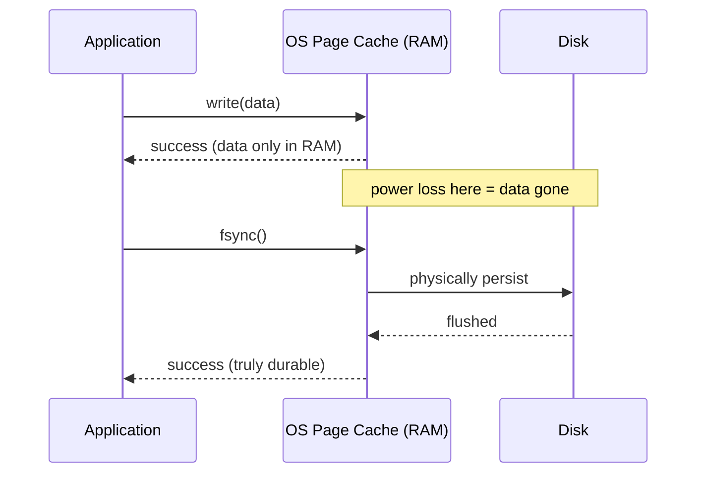
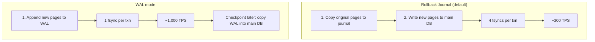
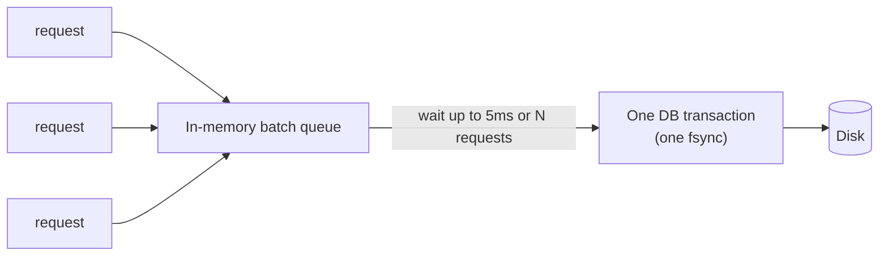
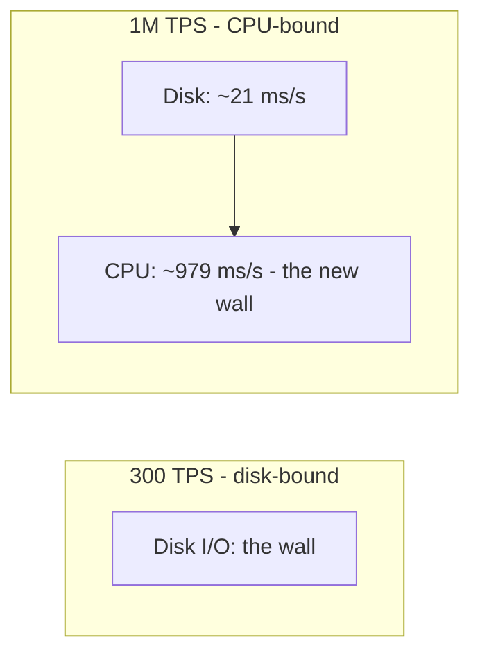

Why is a database "slow" when a CPU can do millions of operations a second? This post answers that by taking one tiny transaction and making it 3,000× faster — from **300 to 1,000,000 transactions per second** — without changing the hardware.

We'll use **SQLite** as the concrete benchmark because it lets us flip one setting at a time and watch the effect. But everything we learn — `fsync`, write-ahead logging, the durability flag, and group commit — works the same way in **PostgreSQL** and **MySQL**. For each claim, I'll note the equivalent setting in those databases.

## 1. The Benchmark and the Math of Latency

Our transaction is a classic bank transfer:

1. **Debit** account A.
2. **Credit** account B.
3. **Verify** neither balance went negative.

With SQLite's default settings, this runs at **338 transactions per second (TPS)**. Turn that around and you get the latency:

```text
1,000 ms ÷ 338 txn/s ≈ 3 ms per transaction
```

Three milliseconds per transaction. That sounds fast — until you remember a modern CPU can execute **millions of instructions** in 3 ms. So the CPU is idle almost the entire time, waiting on something else. The culprit is **durability**.

### RAM is fast, but it forgets

When a database commits, the changes land in **RAM first**. RAM is incredibly fast, but it's **volatile** — pull the power and it's gone. To satisfy the **D** in ACID (**Durability**), the data has to physically reach the **disk**. That trip is what costs milliseconds.

### `write` vs `fsync`

These two system calls look similar but are very different:

- **`write`** just hands the data to the operating system's **page cache** (temporary RAM) and returns "success" immediately. If the power goes out, that data is lost.
- **`fsync`** commands the OS to **physically place the data on the disk and wait for confirmation**. On a typical SSD, a raw `fsync` takes about **6 milliseconds**.

A database must `fsync` to be truly durable — and that's where the 3 ms goes.



## 2. Crash Safety: the Rollback Journal

There's a second problem beyond durability: **atomicity on crash**. Databases store data in fixed-size blocks called **pages**, and one transaction can touch several pages. If the server dies halfway through writing them, some pages are new and some are old — a corrupted database.

SQLite's default fix is the **Rollback Journal**:

### The story, step by step

1. **Before** touching the main database file, copy the **original pages** into a separate **journal** file.
2. Write the **new pages** into the main database file.
3. If a crash happens, SQLite copies the old pages **back** from the journal, reverting to the pre-transaction state.

### The cost: four `fsync`s per transaction

Risk-averse means slow. To be fully safe, the rollback journal needs **four separate `fsync` calls**:

1. Sync the backup pages to the **journal** file.
2. Sync the new pages to the **main** database file.
3. Sync the **directory** (to guarantee the journal file was created).
4. Sync the **header** of the journal file.

Four `fsync`s × ~6 ms each is the hard wall that caps throughput at roughly **300 TPS**. The database is safe, but painfully slow.

## 3. WAL Mode: Append Instead of Back Up

**Write-Ahead Logging (WAL)** does the opposite. Instead of preserving old data, it **appends all new changes to a separate WAL file** and leaves the main file alone for now.

### How it works

- **Writing:** a transaction's new pages are appended to the end of the WAL file. Appending is extremely fast.
- **Reading:** a reader checks the **WAL first**; if the data isn't there, it reads the **main file**. Together they form a consistent view.
- **Checkpointing:** the WAL can't grow forever. Periodically — by default every 1,000 pages — SQLite runs a **checkpoint**, copying the WAL's changes back into the main database and clearing the WAL. (Tunable via `wal_autocheckpoint`.)

### The win

Because it just appends, WAL cuts the requirement from four `fsync`s down to **one per transaction** — a 75% reduction in disk waiting. Throughput jumps from ~300 to **~1,000 TPS**.



| | Rollback Journal | WAL |
|---|---|---|
| What's written | Old pages → journal, new pages → main | New pages appended → WAL |
| `fsync`s per txn | 4 | 1 |
| Readers vs writer | Readers wait for the writer | Readers and writer don't block each other |
| Throughput | ~300 TPS | ~1,000 TPS |

## 4. The `synchronous` Flag: The Real Speed Lever

Here's the twist that surprises most people. WAL mode alone is **not** a 10–20× speedup. The huge speedups credited to it usually come from a second setting, `synchronous`, being changed underneath you by popular ORMs (like `better-sqlite3`).

`synchronous` decides **how strictly the database waits for the disk before returning success**:

| Mode | Waits for `fsync`? | Risk on power loss | Throughput |
|------|--------------------|--------------------|------------|
| **FULL** (default) | On every transaction | None — fully durable | ~1,000 TPS (with WAL) |
| **OFF** | Never — hands data to the OS | **Database can be corrupted** | 100,000+ TPS |
| **NORMAL** (production standard) | Skips `fsync` when appending to WAL, but **forces one at checkpoint** (writing to the main DB) | Lose the last few seconds of un-checkpointed data; **the database never corrupts** | **~12,000 TPS** |

**NORMAL is the sweet spot.** You trade strict durability for the very last few seconds of data, but the database itself is always safe. That single setting is what turns ~1,000 TPS into **~12,000 TPS**.

```sql
-- The two settings that get you most of the way
PRAGMA journal_mode = WAL;
PRAGMA synchronous = NORMAL;
```

> **Cross-DB equivalents:**
> - **PostgreSQL:** `synchronous_commit` (`on` / `off` / `local` / `remote_write`) — same idea, same trade-off.
> - **MySQL (InnoDB):** `innodb_flush_log_at_trx_commit` (`1` = safest, `2`/`0` = faster, less durable).

## 5. Group Commit: Batching to a Million TPS

We're at ~12,000 TPS. To go further, we have to reduce the number of `fsync`s — not per transaction, but **in total**. That's **group commit**.

### The bridge analogy

Imagine a narrow bridge that takes **1 second** to cross.

- One car at a time → **1 person/second**.
- Fifty people on one **bus**, still 1 second to cross → **50 people/second**.

The crossing time didn't change. We just **amortized** it across many people. Group commit does the same with `fsync`.

### The implementation

1. Catch incoming requests and push them onto an **in-memory queue**.
2. Wait for a tiny **batching window** (e.g. **5 ms**) or a **max batch size**.
3. Wrap the whole queue in **one database transaction** — a **single `fsync`** for the entire batch.

```python
batch = []
while True:
    batch.append(queue.get())                       # collect requests
    if len(batch) >= MAX_BATCH or window_elapsed_5ms():
        db.execute("BEGIN")
        for req in batch:
            apply(req)                              # all in one transaction
        db.execute("COMMIT")                        # ONE fsync for the batch
        batch.clear()
```

The trade-off is latency vs throughput: a **longer** window batches more (higher throughput) but makes individual requests wait; a **shorter** window keeps latency low but shrinks the batches. At a batch of ~28,000 concurrent requests, this benchmark reaches **1,000,000 TPS**.



> **Cross-DB:** group commit isn't a trick you have to build everywhere — PostgreSQL and MySQL InnoDB both do **automatic group commit** internally when many transactions commit at once. SQLite just makes you batch explicitly.

## 6. Amdahl's Law and the CPU Bottleneck

Why did we stop at 1M TPS? Two reasons, both captured by **Amdahl's Law**: *the speedup from optimizing one part is limited by how much that part is used — always fix the slowest step.*

For most of this post, **disk I/O was the bottleneck**. But at 1M TPS, writing ~35 large batches per second, disk time shrinks to almost nothing:

```text
35 batches/s × ~6 ms ≈ 21 ms of the 1,000 ms second
```

The other **979 ms** is now pure **CPU**. A 5.4 GHz processor doing 1M transactions in 979 ms leaves roughly:

```text
~5,300 CPU cycles per transaction
```

In those ~5,300 cycles the CPU must look up pages, walk the in-memory B-tree, update the balance, and run the two queries. It physically can't do more. **The bottleneck moved from disk to CPU.**



And this benchmark only measures raw database writes. A real server also parses HTTP, serializes JSON, and runs business logic — so in production you **spread compute across many CPU cores** and stream only validated requests to the database core.

## 7. TPS Progression at a Glance

| Configuration | `fsync`s per transaction | Throughput |
|---|---|---|
| Rollback journal (default) | 4 | ~300–338 TPS |
| WAL + `synchronous = FULL` | 1 | ~1,000 TPS |
| WAL + `synchronous = NORMAL` | ~0 (deferred to checkpoint) | ~12,000 TPS |
| WAL + NORMAL + group commit | 1 per **batch** | ~1,000,000 TPS |

## 8. How This Maps to PostgreSQL and MySQL

| Concern | SQLite | PostgreSQL | MySQL (InnoDB) |
|---|---|---|---|
| Durability call | `fsync` | `fsync` | `fsync` |
| Log | Rollback journal / WAL | Write-ahead log (WAL) | Redo log (+ doublewrite buffer) |
| Durability knob | `PRAGMA synchronous` | `synchronous_commit` | `innodb_flush_log_at_trx_commit` |
| Group commit | You batch explicitly | Built-in | Built-in |
| Checkpointing | `wal_autocheckpoint` | `checkpoint_timeout` | redo/checkpoint settings |

The principles are identical: **durability costs `fsync`s; WAL reduces them; the durability flag trades some durability for speed; batching amortizes the rest.**

## Key Takeaways

1. **3 ms per transaction is mostly waiting on disk.** The CPU is idle; durability is the cost.
2. **`write` ≠ `fsync`.** `write` returns immediately (RAM); `fsync` waits for the disk — that's what the "D" in ACID requires.
3. **Rollback journals are safe but heavy** — 4 `fsync`s per transaction caps you near 300 TPS.
4. **WAL appends instead of backing up** — 1 `fsync` per transaction, ~1,000 TPS, and readers don't block writers.
5. **The `synchronous` flag is the real lever.** `NORMAL` defers `fsync` to checkpoints and hits ~12,000 TPS while never corrupting the database.
6. **Group commit amortizes `fsync` across a batch** — the bridge analogy — and pushes to ~1M TPS.
7. **Every bottleneck has a next one.** Amdahl's Law: once disk is solved, the CPU becomes the wall.

## Mini Glossary

| Term | Meaning |
|------|---------|
| TPS | Transactions per second |
| `fsync` | System call that forces data onto disk and waits |
| Page | A fixed-size block the database reads/writes |
| Rollback journal | Backs up original pages so a crash can revert |
| WAL | Write-Ahead Log — append changes to a log first |
| Checkpoint | Copying WAL changes back into the main database |
| `synchronous` | How strictly the DB waits for disk before "success" |
| Group commit | Batching many transactions into one `fsync` |
| Amdahl's Law | Speedup is limited by the part you didn't optimize |
| Volatile | Lost on power loss (e.g. RAM) |